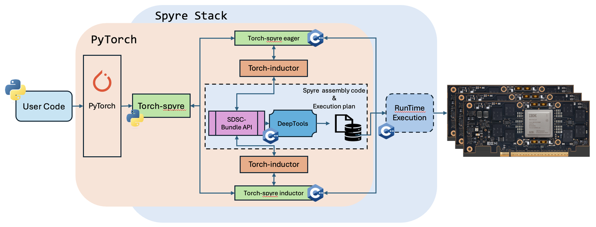
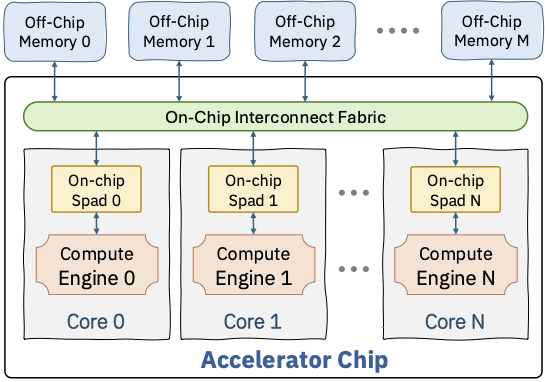

# **SuperDSC-Bundle Interface Specification**

**Spec Version:** 1.0.0
**Status:** Active

> The spec version follows the deeptoolsRelease versioning.

**Authors:**
* @lupalby
* @Prasanth-Chatarasi
* @bmahjour
* @viji560
* @vswagath1989
* @jneves60

## **Summary**

This document describes the `SuperDSC-Bundle`, the interface between the torch-spyre frontend compiler and the Spyre backend compiler (Deeptools).

For the detailed API reference organized by learning stage see the [SDSC Bundle API Documentation](sdsc_BUNDLE_APIs/README.md).

## **Motivation**
The interface is essential to connect the torch-spyre frontend compiler with the Deeptools backend compiler to successfully map any operation to Spyre.

## **Proposed Implementation**

The figure below illustrates what is called the Spyre Stack, where a user-written PyTorch program is compiled by torch-spyre to generate a set of files known as the **SuperDSC-Bundle**. A PyTorch file may translate into several SuperDSC-Bundles, each one composed of a `bundle.mlir` file and several `sdsc_*.json` files. Each SuperDSC-Bundle is compiled by Deeptools to generate the assembly code and execution plan that runs on the Spyre AI Accelerator Card.

<p align="center">
  
</p>
<p align="center">
  Figure 1. High-level view of SuperDSC-Bundle API within the torch-spyre stack
</p>

`SuperDSC-Bundle` views the Spyre hardware at the data-parallel level of hardware abstraction. In this abstraction, Spyre is viewed as having multiple cores, with each core having a compute engine and a scratchpad memory. The cores are interfaced with each other and off-chip memory banks using an on-chip interconnect fabric.

<p align="center">
  
</p>
<p align="center">
  Figure 2. Hardware abstraction of multi-core accelerator embodied in `SuperDSC-Bundle`
</p>

`SuperDSC-Bundle` enables the frontend compilers to express data-parallel mappings of:
* Complex kernels comprised of a sequence of operations
* The work division (or computation split) across RaPiD cores of Spyre for each operation
* The placement of input/output tensors to each operation either in DDR memory or LX scratchpad of the RaPiD cores
* Shapes of the operations and tensors is allowed to be static or symbolic
* The start address of the tensors in DDR and LX is allowed to be a fixed number or symbolic

The `SuperDSC-Bundle` specification is used by the Deeptools backend compiler to produce `SpyreCode` containing the job binary, a job plan and other compiled artifacts. In the scenario where either the start-address and/or shapes are symbolic, `SpyreCode` allows for the program binary to contain variables that need to be substituted or corrected before execution. The mechanism to effect program correction just-in-time before the job is launched onto Spyre is also produced by the backend compiler as part of `SpyreCode`.

NOTES:
* Frontend/Backend compiler interface will transition to a new interface called Kernel Tile Intermediate Representation (KTIR) in the future (https://github.com/torch-spyre/rfcs/blob/main/0682-KtirSpec/0682-KtirSpecRFC.md)
* `SuperDSC` (without bundle capability) is the current interface between Deeptools frontend compiler and Deeptools backend compiler
* `SpyreCode` is tracked through: https://github.com/torch-spyre/torch-spyre/issues/277

## Structure of SuperDSC-Bundle

The backend expects the frontend to produce multiple output files that work in conjunction to instruct the backend on how one or multiple programs can be compiled and executed in a sequence as part of a complex kernel. The expectation is to receive:
* one or more `sdsc_*.json` files, each describing a Spyre operation
* one `bundle.mlir` file with the SuperDSC-Bundle IR

### API Components

The API consists of two primary components:

1. **MLIR Bundle File** (`.mlir`) — Orchestrates execution flow, symbol management, and operation sequencing across one or more SDSC JSON files. See [MLIR Bundle API](sdsc_BUNDLE_APIs/MLIR-bundle-API.md) for the full dialect reference.
2. **SDSC JSON Files** (`.json`) — Each file defines a single operation and its core mapping. See [SDSC JSON API](sdsc_BUNDLE_APIs/SDSC-json-api.md) for the step-by-step filling guide.

All `sdsc_*.json` files must conform to the [SDSC Bundle JSON Schema](sdsc_BUNDLE_APIs/sdscbundle-schema.json). The schema is the normative reference for structural correctness — it enforces required fields, enum values, and type constraints at every level of the object hierarchy. Semantic constraints (cross-field consistency) are described in the individual object pages linked from [SDSC JSON API](sdsc_BUNDLE_APIs/SDSC-json-api.md).

### SuperDSC JSON Structure

SuperDSC is a self-contained compiled artifact that describes everything the Spyre hardware needs to execute a single scheduled operation deterministically. The top-level structure contains core fold properties, work-slice mappings, and a per-core execution schedule. A `dscs_` array holds one or more `DesignSpaceConfig` entries, each being a complete description of one compute configuration. See the [JSON Object Hierarchy](sdsc_BUNDLE_APIs/JSON-object-Hierarchy.md) for the full object tree.

Each `DesignSpaceConfig` entry contains the following elements:

- **Core fold properties** (`coreFoldProp_`, `numWkSlicesPerDim_`, `coreIdToWkSlice_`): how to divide the iteration space across 32 cores. For a tensor of shape (1024, 256), this encodes how many rows each core processes. The encoding gives each core an equal number of sticks and keeps each core within its addressable device memory limit.
- **Tensor descriptors** (`labeledDs_`, `primaryDsInfo_`): for each tensor argument, the tiling structure defines which dimensions are stick dimensions, how the host-side shape maps to device-side tiles, memory residency (HBM vs. LX scratchpad), data format, and which dimensions each tensor iterates over fully vs. which are summed over (contracted) as in the K dimension of a matmul.
- **Schedule tree** (`scheduleTree_`): a list of allocate nodes (one per tensor) that specify memory placement (HBM or LX scratchpad), dimension ordering, per-core start addresses via fold mappings, and coordinate information encoding how each dimension is split across cores with affine transformations.
- **Data staging** (`dataStageParam_`): per-core dimension sizes for steady-state and epilogue passes, describing how data is partitioned for transfer into scratchpad.
- **Compute operations** (`computeOp_`): one entry per operation, encoding the execution unit (PT or SFP), operation name, data format, fidelity, and the input/output tensor references from `labeledDs_`.

**Folding** is a central concept in SuperDSC. A single parameterized artifact can represent multiple execution variants across time steps and cores without recompilation. Fold properties use affine transformations (`alpha * index + beta`) to compute per-core coordinates and addresses, so one JSON file describes the behavior of all 32 cores compactly instead of duplicating the description for each core. See [FoldProperty](sdsc_BUNDLE_APIs/foldproperty.md) and [FoldManager](sdsc_BUNDLE_APIs/foldmanager.md) for details.

### Important Notes

**DesignSpaceConfig can represent BOTH deep learning operators AND data-shuffle operations:**

- **Deep learning operators**: Matmul, convolution, activations, reductions, etc.
- **Data-shuffle operations**: Stick-breaking, non-stick breaking, gather, scatter

**Tensor allocation need NOT be compatible with compute work division.** Data in one core can be directly available for compute in another core — the backend compiler will ensure proper data movement across cores. This functionality is fully supported by the backend.

### SuperDSC-Bundle MLIR Representation

The `bundle.mlir` file conveys a complex kernel made of one or multiple operations. It chains together multiple SDSC operations in sequence and can add loops around them using new and existing MLIR operations. For the complete dialect reference with all syntax tables and examples see [MLIR Bundle API](sdsc_BUNDLE_APIs/MLIR-bundle-API.md).

#### Bundle Container

A SuperDSC Bundle is expressed as a standard MLIR `module` containing a single `func.func`. The function declares the bundle entry point: it has no return values and its body ends with `return`. It may declare zero or more parameters — each is either a compile-time `index` value or a runtime-provided `!sdscbundle.input_arg<index>` value (which must be extracted with `sdscbundle.input_arg_extract` before use).

```mlir
module {
  func.func @sdsc_bundle(%param_0: index,
                         %param_1: !sdscbundle.input_arg<index>) {
    // Bundle operations
    return
  }
}
```

Each parameter is one of:

| Type | Description |
|---|---|
| *(none)* | No parameters — all symbol values are embedded as `arith.constant` values inside the function body. |
| `index` | A resolved symbol value passed directly as a constant index. |
| `!sdscbundle.input_arg<index>` | A runtime-provided symbol value. May carry optional `granularity=N` and/or `max_value=N` annotations. Must be extracted with `sdscbundle.input_arg_extract` before use. |

#### Symbolic Values and Addresses

Within a SuperDSC Bundle there are two distinct ways a value can be symbolic — not fixed at compile time and resolved by the backend just before the job is launched.

**Symbolic Addresses** — a tensor's start address in device memory is not a concrete byte offset at compile time. On the JSON side: set `isStartAddrSymbolic_: true` on the `allocate` node in `scheduleTree_` and place symbolic identifier strings in `startAddressCoreCorelet_.data_`. On the MLIR side: supply the runtime value as an operand to `sdscbundle.sdsc_execute` via `symbol_ids`.

**Symbolic Dimension Sizes** — a tensor shape dimension (e.g. sequence length or batch size) varies at runtime. On the JSON side: `DesignSpaceConfig.dimToSymbolMapping_` maps dimension names to symbolic variable names; `DataStructDims.symbolicDimInfo_` records `maxSize_` and `granularity_` for each symbolic dimension; `SuperDsc.symbolDefinitions_`, `inputSymbolsAndTags_`, and `dimToSymbolMappingOpcodeCorrection_` hold the top-level symbol registry. On the MLIR side: the runtime value is also supplied as an operand to `sdscbundle.sdsc_execute` via `symbol_ids` — the same mechanism as symbolic addresses.

From the MLIR perspective both kinds of symbolic value are unified: they are operands to `sdscbundle.sdsc_execute` bound via `symbol_ids`. The distinction is on the JSON side — the backend routes each symbol ID to the appropriate field depending on whether it is bound to an `isStartAddrSymbolic_` allocate node (address) or to a `dimToSymbolMapping_` entry (size). When a symbolic dimension is split across cores, both kinds appear together in the same JSON file.

#### `sdscbundle` Dialect Operations

The following operations are defined by the `sdscbundle` dialect and are the primary means by which a frontend compiler communicates with the Spyre backend.

| Operation | Summary |
|---|---|
| `sdscbundle.sdsc_execute` | Instantiates and executes one SDSC JSON operation. |
| `sdscbundle.device_mem_allocate` | Allocates a contiguous device memory buffer for intermediate or scratch tensors. |
| `sdscbundle.input_arg_extract` | Extracts a named field (`value`, `granularity`, or `max_value`) from a `!sdscbundle.input_arg<index>` bundle parameter. |

##### `sdscbundle.sdsc_execute`

Instantiates and executes a SuperDSC operation. Each call references one SDSC JSON file. Multiple calls in sequence express kernel fusion — each invocation optionally substitutes symbolic addresses or sizes with the SSA values provided as operands.

```mlir
sdscbundle.sdsc_execute (%operand1, %operand2, ...) {
  sdsc_filename = "path/to/sdsc.json",
  symbol_ids = [id1, id2, ...]
}
```

**Attributes:**
- `sdsc_filename` (required): relative path to the SDSC JSON file; path is relative to the MLIR file location.
- `symbol_ids` (optional): list of negative integer symbol IDs (e.g. `-1`, `-2`). Each maps positionally to one operand. IDs must be unique across the bundle unless both invocations assign the same value. Inside an `scf.for` loop body, the same IDs may be reused across iterations.

**Operands:** SSA values of type `index` supplying runtime values for each symbol ID, in the same order. Can be `arith.constant`, the return of `sdscbundle.device_mem_allocate`, a value extracted via `sdscbundle.input_arg_extract`, or an `affine.apply` expression.

**Returns:** None.

Example — softmax kernel fusion (six sequential operations):

```mlir
module {
  func.func @sdsc_bundle() {
    sdscbundle.sdsc_execute () {sdsc_filename="sdsc_0_max.json"}
    sdscbundle.sdsc_execute () {sdsc_filename="sdsc_1_sub.json"}
    sdscbundle.sdsc_execute () {sdsc_filename="sdsc_2_exp.json"}
    sdscbundle.sdsc_execute () {sdsc_filename="sdsc_3_sum.json"}
    sdscbundle.sdsc_execute () {sdsc_filename="sdsc_4_reciprocal.json"}
    sdscbundle.sdsc_execute () {sdsc_filename="sdsc_5_mul.json"}
    return
  }
}
```

##### `sdscbundle.device_mem_allocate`

Allocates a contiguous range of device memory for buffers that are neither kernel inputs nor outputs — intermediate tensors passed between consecutive SDSCs and scratch space consumed internally by a single SDSC. The backend reserves the requested bytes before the first SDSC executes and holds them for the entire kernel lifetime; there is no matching deallocate.

```mlir
%result = sdscbundle.device_mem_allocate <size> bytes : index
```

**Attributes:**
- `size` (required): size in bytes — must be a positive compile-time constant. Maximum single request is ~15 GB (underlying segment is 16 GB; 1 GB reserved for backend programs and correction tensors).

**Returns:** A single `index` SSA value — the device byte address of the first byte of the allocated buffer. Contents are undefined at allocation.

**Constraints:**
- Must appear in the entry block of the bundle function, outside any `scf.for`. An allocation inside a loop still reserves only one buffer for the entire kernel.
- Each call gets its own non-overlapping range. Total device memory required is the sum of all requests and must stay within ~15 GB.
- To reuse space across tensors with non-overlapping live ranges, issue a single large allocation and sub-allocate using `arith.addi` offsets (the frontend owns layout and alignment).

Example — 64 KB pool carved into four 16 KB sub-buffers:

```mlir
%pool = sdscbundle.device_mem_allocate 65536 bytes : index

%off_0     = arith.constant 0     : index
%off_16384 = arith.constant 16384 : index
%off_32768 = arith.constant 32768 : index
%off_49152 = arith.constant 49152 : index

%addr_0     = arith.addi %pool, %off_0     : index   // sdsc_0 output, sdsc_2 input
%addr_16384 = arith.addi %pool, %off_16384 : index   // sdsc_1 output, sdsc_2 input
%addr_32768 = arith.addi %pool, %off_32768 : index   // sdsc_2 output, sdsc_3 input
%addr_49152 = arith.addi %pool, %off_49152 : index   // sdsc_3 scratch

sdscbundle.sdsc_execute (%arg_0, %addr_0)                   {sdsc_filename="sdsc_0.json", symbol_ids=[-1, -2]}
sdscbundle.sdsc_execute (%arg_1, %addr_16384)               {sdsc_filename="sdsc_1.json", symbol_ids=[-3, -4]}
sdscbundle.sdsc_execute (%addr_0, %addr_16384, %addr_32768) {sdsc_filename="sdsc_2.json", symbol_ids=[-5, -6, -7]}
sdscbundle.sdsc_execute (%addr_32768, %addr_49152, %arg_2)  {sdsc_filename="sdsc_3.json", symbol_ids=[-8, -9, -10]}
```

##### `sdscbundle.input_arg_extract`

Extracts a named field from a `!sdscbundle.input_arg<index>` bundle parameter. Every `func.func` parameter of this type must be unwrapped with this operation before its value can be used in arithmetic or passed to `sdscbundle.sdsc_execute`.

Extractable fields:
- `value` — the runtime base address or dimension size provided by the caller. Available on all `input_arg` parameters.
- `granularity` — the step constraint for a symbolic dimension size; corresponds to `granularity_` in [`SymbolicDimInfo`](sdsc_BUNDLE_APIs/datastructdims.md).
- `max_value` — the upper bound for a symbolic dimension size; corresponds to `maxSize_` in [`SymbolicDimInfo`](sdsc_BUNDLE_APIs/datastructdims.md).

```mlir
%result = sdscbundle.input_arg_extract value       from %arg : !sdscbundle.input_arg<index> -> index
%result = sdscbundle.input_arg_extract granularity from %arg : !sdscbundle.input_arg<index, granularity=N> -> index
%result = sdscbundle.input_arg_extract max_value   from %arg : !sdscbundle.input_arg<index, max_value=N> -> index
```

Example — symbolic dimension with granularity and max_value:

```mlir
module {
  func.func @sdsc_bundle(%M_sym: !sdscbundle.input_arg<index, granularity=64, max_value=1024>) {
    %val  = sdscbundle.input_arg_extract value       from %M_sym
              : !sdscbundle.input_arg<index, granularity=64, max_value=1024> -> index
    %gran = sdscbundle.input_arg_extract granularity from %M_sym
              : !sdscbundle.input_arg<index, granularity=64> -> index
    %max  = sdscbundle.input_arg_extract max_value   from %M_sym
              : !sdscbundle.input_arg<index, max_value=1024> -> index
    sdscbundle.sdsc_execute (%val) {sdsc_filename="sdsc_0.json", symbol_ids=[-1]}
    return
  }
}
```

#### Supporting MLIR Operations

The following operations are part of standard upstream MLIR dialects, used here only in the context of their permitted use within SDSC Bundles. For full specifications see the [MLIR dialect documentation](https://mlir.llvm.org/docs/Dialects/).

| Operation | Summary |
|---|---|
| `scf.for` | Loop construct for iterating over a range of SDSC executions. |
| `arith.constant` | Defines a compile-time constant SSA value (e.g. a base address or size). |
| `arith.addi` | Integer addition — used to compute addresses from a base and an offset. |
| `affine.apply` | Applies an affine map to compute per-iteration or per-core addresses. |

##### `scf.for`

Loop construct from the SCF dialect. Used to iteratively execute one or more SDSC operations (see [`scf.for` documentation](https://mlir.llvm.org/docs/Dialects/SCFDialect/#scffor-scfforop)).

```mlir
scf.for %iterator = %lower_bound to %upper_bound step %step {
  // Loop body with SDSC executions
}
```

**Constraints:**
- Lower bound, upper bound, and step must all be resolvable to compile-time constants. No symbolic or runtime loop bounds are supported.
- Loop-carried variables are not supported. The induction variable may be used freely inside the body (e.g. as an operand to `affine.apply` or `arith.addi`).
- `sdscbundle.device_mem_allocate` should not appear inside the loop body — if it does, the backend still reserves only one buffer for the entire kernel, not one per iteration.

Example:

```mlir
%c0 = arith.constant 0 : index
%c1 = arith.constant 1 : index
%c8 = arith.constant 8 : index

scf.for %i = %c0 to %c8 step %c1 {
  %addr = affine.apply affine_map<(d0) -> (1024 + 128*d0)> (%i)
  sdscbundle.sdsc_execute (%addr) {sdsc_filename="sdsc.json", symbol_ids=[-1]}
}
```

##### `arith.constant`

Defines a compile-time constant SSA value. Used to define base addresses, loop bounds, step values, and sub-allocation offsets. Type must be `index` in SDSC Bundle usage.

```mlir
%name = arith.constant <value> : index
```

##### `arith.addi`

Integer addition of two `index` SSA values. Used to compute memory addresses by adding a constant offset to a base address.

```mlir
%result = arith.addi %lhs, %rhs : index
```

##### `affine.apply`

Applies a compile-time affine map to dimension and symbol operands, producing a single `index` result. Used to compute per-iteration or per-core memory addresses from a base address and loop variables. The affine map must be a linear combination of its dimension and symbol variables; symbol variables must be loop-invariant.

```mlir
%result = affine.apply affine_map<(dims)[symbols] -> (expression)> (dim_values)[symbol_values]
```

Example — stride-based address computation:

```mlir
#stride_map = affine_map<(d0)[base] -> (base + 128*d0)>
%addr = affine.apply #stride_map (%i)[%base_address]
```

### `sdsc_*.json` Filling

Each `sdsc_*.json` file describes a single torch operation. This section walks through filling one in the same order as the [SuperDsc object hierarchy](sdsc_BUNDLE_APIs/JSON-object-Hierarchy.md). For the complete step-by-step reference with all field constraints see [SDSC JSON API](sdsc_BUNDLE_APIs/SDSC-json-api.md).

| Step | Object / Field | Reference |
|---|---|---|
| 1 | Root key · `SuperDsc`: `coreFoldProp_`, `coreletFoldProp_`, `numCoresUsed_` | [SuperDsc Object](sdsc_BUNDLE_APIs/superdsc-object.md) |
| 2 | `SuperDsc`: `numWkSlicesPerDim_`, `coreIdToWkSlice_`, `coreIdToDsc_`, `coreIdToDscSchedule` | [SuperDsc Object](sdsc_BUNDLE_APIs/superdsc-object.md) |
| 3 | `dscs_` entry · `DesignSpaceConfig`: `numCoresUsed_`, `coreIdsUsed_` | [DesignSpaceConfig](sdsc_BUNDLE_APIs/designspaceconfig.md) |
| 4 | `DesignSpaceConfig`: `N_`, `dataStageParam_` | [DataStructDims](sdsc_BUNDLE_APIs/datastructdims.md) · [DataStageParam](sdsc_BUNDLE_APIs/datastageparam.md) |
| 5 | `DesignSpaceConfig`: `primaryDsInfo_` | [PrimaryDsInfo](sdsc_BUNDLE_APIs/primarydsinfo.md) · [Stick Layout Constraints](sdsc_BUNDLE_APIs/stick-layout-constraints.md) |
| 6 | `DesignSpaceConfig`: `scheduleTree_` → `ScheduleTreeNode` → `coordinates_` → `CoordinateInfo` | [ScheduleTreeNode](sdsc_BUNDLE_APIs/scheduletreenode.md) · [CoordinateInfo](sdsc_BUNDLE_APIs/coordinateinfo.md) |
| 7 | `DesignSpaceConfig`: `labeledDs_` → `LabeledDataStructure` → `memOrg_` | [LabeledDataStructure](sdsc_BUNDLE_APIs/labeleddatastructure.md) · [MemoryOrganization](sdsc_BUNDLE_APIs/memoryorganization.md) |
| 8 | `DesignSpaceConfig`: `constantInfo_` → `ConstantInfo` | [ConstantInfo](sdsc_BUNDLE_APIs/constantinfo.md) |
| 9 | `DesignSpaceConfig`: `computeOp_` → `ComputeOperation` | [ComputeOperation](sdsc_BUNDLE_APIs/computeoperation.md) |

#### Step 1 — Root key and SuperDsc fold properties

Create the root object with a single key — the operation name string (pattern `^[a-zA-Z0-9_/\-][a-zA-Z0-9_/\-]*$`). Its value is the [`SuperDsc`](sdsc_BUNDLE_APIs/superdsc-object.md) object. Fill the fold properties first, as every [`FoldManager`](sdsc_BUNDLE_APIs/foldmanager.md) used later inherits from these:

- Set `coreFoldProp_.factor_` to a value between 1 and the maximum number of cores in use (e.g. `32` for a full-chip bundle). Set `label_` to `"core"`.
- Set `coreletFoldProp_.factor_` to `2`. Set `label_` to `"corelet"`.
- Set `numCoresUsed_` to the total number of cores.
- (Optional) Set `sdscFoldProps_` and `sdscFolds_` only when bundle-level fold dimensions above the core level are required.

#### Step 2 — SuperDsc work-division maps

Still in [`SuperDsc`](sdsc_BUNDLE_APIs/superdsc-object.md), fill the maps that assign work slices and DSC indices to cores:

- Set `numWkSlicesPerDim_`: for each dimension being split across cores, record the total number of slices (e.g. `{"mb": 2}` for a 2-way minibatch split).
- Set `coreIdToWkSlice_`: for each core ID, map each split dimension to the slice index that core handles (e.g. `{"0": {"mb": 0}, "1": {"mb": 1}}`).
- Set `coreIdToDsc_`: map each core ID (as a string integer) to its zero-based index into `dscs_`. All cores typically map to `0` when work is balanced.
- Set `coreIdToDscSchedule`: for each core, one schedule tuple `[-1, 0, 0, 0]` covers the common case (single DSC, no data-op DSC, no barriers). The four integers are `[datadsc_idx, dldsc_idx, before_sync, after_sync]`. See [SuperDsc Object — Schedule step tuple](sdsc_BUNDLE_APIs/superdsc-object.md#schedule-step-tuple) for details.
- (Optional) Populate `inputSymbolsAndTags_`, `symbolDefinitions_`, and `dimToSymbolMappingOpcodeCorrection_` when symbolic dimensions are used.
- (Optional) Populate `datadscs_` as `[]` when symbolic dimensions are present; omit otherwise.

> **Note on field naming:** `coreIdToDscSchedule` lacks the trailing underscore used by most other fields. Do not add a trailing underscore when writing bundle JSON — this inconsistency is a known anomaly.

#### Step 3 — DesignSpaceConfig identity

Add one entry to `dscs_` — a single-key object `{"<op_name>": <DesignSpaceConfig>}`. Inside the [`DesignSpaceConfig`](sdsc_BUNDLE_APIs/designspaceconfig.md), set the core identity fields first:

- Set `numCoresUsed_` and `coreIdsUsed_` to match the cores assigned to this DSC via `coreIdToDsc_` in Step 2.

#### Step 4 — Total operation dimensions (`N_`) and data staging (`dataStageParam_`)

In [`DesignSpaceConfig.N_`](sdsc_BUNDLE_APIs/datastructdims.md):

- Set each dimension field that participates in the operation to its total (un-tiled) size. Set all others to `-1`.
- For symbolic dimensions, set the field to `-1` (sentinel) and populate `dimToSymbolMapping_` to link each symbolic dimension name to its symbol ID.
- For symbolic dimensions: add `symbolicDimInfo_` inside each [`DataStructDims`](sdsc_BUNDLE_APIs/datastructdims.md) with `maxSize_` (upper bound) and `granularity_` (step constraint). Use `maxSymbolicVolume_` to cap the combined volume across a set of symbolic dimensions.

In [`DesignSpaceConfig.dataStageParam_`](sdsc_BUNDLE_APIs/datastageparam.md):

- Add exactly one entry with key `"0"`. Set `name_` to `"core"`.
- Set `ss_` and `el_` to the per-core tile sizes. When work divides evenly `ss_` and `el_` are identical; `el_` carries the smaller final tile when it does not.
- For window/padded operations (avgpool2d, maxpool2d, conv2d, depthwise conv2d): add `paddingSizes_` to both `ss_` and `el_`. If a padded dimension is split across cores, set `padFront_` and `padBack_` to `-1` in the per-core datastage entry. See [Padding](sdsc_BUNDLE_APIs/padding.md) for the full field set.
- For symbolic dimensions split across cores: `granularity_` must be a multiple of the number of cores in the split, and `ss_`/`el_` values must be scaled to the per-core size.

#### Step 5 — Tensor layout (`primaryDsInfo_`)

In [`DesignSpaceConfig.primaryDsInfo_`](sdsc_BUNDLE_APIs/primarydsinfo.md), add one entry for each distinct tensor role. Multiple tensors that share the same stick layout can share one entry:

- Key each entry by `dsType_` (`"INPUT"`, `"OUTPUT"`, `"KERNEL"`, `"KERNEL_IDX"`).
- Set `layoutDimOrder_` (outermost dimension first).
- Set `stickDimOrder_` and `stickSize_` as parallel arrays. Consult [Stick Layout Constraints](sdsc_BUNDLE_APIs/stick-layout-constraints.md) for the exact stick rules for each operation category.

#### Step 6 — Memory allocation schedule (`scheduleTree_`)

In [`DesignSpaceConfig.scheduleTree_`](sdsc_BUNDLE_APIs/scheduletreenode.md), add one [`ScheduleTreeNode`](sdsc_BUNDLE_APIs/scheduletreenode.md) per tensor, in allocation order:

- Set `nodeType_: "allocate"`, a unique `name_`, and `ldsIdx_` matching the tensor's sequential position in `labeledDs_` (filled in Step 7).
- Set `component_` to `"hbm"` or `"lx"`.
- for HBM allocations, whether the tensor is stored as a single unified tensor or per core
  - `bool nonUnifiedAllocInHBM_` in AllocateNode
  - `false` (default): unified allocation. The tensor lives in HBM as one single tensor covering all cores, sized by the total dimensions `N_` in `sdsc.dscs_[0]`. The data each core needs is a sub-rectangle of that one tensor. A start address is still filled for every core, but all of them are positions inside that one tensor: each core's address is the start of its sub-rectangle, i.e. a common tensor base plus the offset given by the core's slice coordinates and the layout strides.
  - `true`: non-unified allocation. The HBM data needed by each core is stored as its own smaller tensor, sized by the per-core ("core") datastage instead of by `N_`. Each of these per-core tensors is placed independently: they need not be contiguous with one another, need not follow a common stride, and can be at unrelated locations in HBM, so there is no single unified tensor holding the whole data structure.
    - the per-core entries of `FoldManager<int64_t> startAddressCoreCorelet_` point to these independent per-core tensors, rather than to sub-rectangles of one unified tensor as in the unified case, so they need not be derivable from a common tensor base and the layout strides
    - within each per-core tensor the layout is described as usual (`layoutDimOrder_` in `AllocateNode`, stick layout in `primaryDsInfo_`); only the placement of the per-core tensors in HBM differs from the unified case
    - the allocation coordinates use the same core fold convention as an LX allocation (see below), since each core holds only its own slice of the data structure
    - typically used when the tensor is produced or consumed core-wise (e.g. the producing SDSC wrote each core's slice at its own address) and the frontend does not want to materialize a unified copy of it
    - only meaningful when `component_` is HBM; leave `false` for LX allocations
- Set `layoutDimOrder_` and `maxDimSizes_` (use `-1` for unbound dimensions; use the page size for paged value tensors).
- Set `startAddressCoreCorelet_` ([`FoldManager`](sdsc_BUNDLE_APIs/foldmanager.md)) — start address per core:
  - first fold is for cores, set as Map fold type
      - alpha=1, beta=0, factor=4
  - coordinates also require spatial folds
    - core fold
      - for HBM, N/A → alpha=1, factor=1
      - for unified HBM allocations, N/A → alpha=1, factor=1
      - for LX, alpha=coordinate offset across slices, factor=number of slices in dimension
      - for non-unified HBM allocations (`nonUnifiedAllocInHBM_` set), same as LX, as each core holds only its own slice
    - corelet fold: N/A → alpha=1, factor=1
    - row fold: N/A → alpha=1, factor=1
- For back-gaps: populate `backGapCore_` with the gap in elements, keyed by dimension then core ID. Use `"-1"` as the core key for HBM; use the actual core ID for LX. Only back-gaps are encoded — front gaps are handled by advancing the start address. See [Stick-Alignment Padding](sdsc_BUNDLE_APIs/stick-padding.md) for the restickify case where stick-alignment widening is the source of the gap.
- For indirect access (paged tensors): set `indirectAllocType_` to `"value_tensor"` or `"index_tensor"`, set `relatedIndirectAccessAlloc_` to the counterpart node name, and set `indexTensorType_` (`"index"` or `"address"`) on the index tensor node.
- Set `coordinates_` (a [`CoordinateContainer`](sdsc_BUNDLE_APIs/coordinatecontainer.md)): for each tensor dimension, add a [`CoordinateInfo`](sdsc_BUNDLE_APIs/coordinateinfo.md) entry whose `folds` [`FoldManager`](sdsc_BUNDLE_APIs/foldmanager.md) encodes the affine split hierarchy (core → corelet → row → elements). The product of all `factor_` values across all fold levels must equal the total element count for that dimension.

Example coordinate sequence `0, 1, 2, 3, 64, 65, 66, 67, 4, 5, 6, 7, 68, 69, 70, 71` is expressed as folds (outer to inner): `alpha=4, beta=0, factor=2` → `alpha=64, beta=0, factor=2` → `alpha=1, beta=0, factor=4`. Coordinates also require spatial folds: for unified HBM core fold use `alpha=1, factor=1`; for LX use `alpha=coordinate offset across slices, factor=number of slices`; for non-unified HBM (`nonUnifiedAllocInHBM_: true`) use the same convention as LX, since each core holds only its own slice.

#### Step 7 — Tensor descriptors (`labeledDs_`)

In [`DesignSpaceConfig.labeledDs_`](sdsc_BUNDLE_APIs/labeleddatastructure.md), add one [`LabeledDataStructure`](sdsc_BUNDLE_APIs/labeleddatastructure.md) per tensor in the same order used for `ldsIdx_` in Step 6:

- Assign sequential `ldsIdx_` values (0, 1, 2, …) and a unique `dsName_`.
- Set `dsType_` to match the key used in `primaryDsInfo_` (Step 5).
- Set `dataFormat_` and optionally `wordLength`.
- Set `scale_`: one entry per layout dimension in `layoutDimOrder_` order. `1` = normal, `-1` = reduced/broadcast, `-2` = reduced/broadcast stick dimension.
- Set `memOrg_` ([`MemoryOrganization`](sdsc_BUNDLE_APIs/memoryorganization.md)): set `hbm.isPresent` and/or `lx.isPresent` to `1` to match the `component_` set on the corresponding `scheduleTree_` node (Step 6).

#### Step 8 — Constants (`constantInfo_`)

In [`DesignSpaceConfig.constantInfo_`](sdsc_BUNDLE_APIs/constantinfo.md):

- If the operation requires no constants, set the field to the string `"{}"` (do not omit the field).
- Otherwise, add one entry per constant, keyed by sequential string integer (`"0"`, `"1"`, …). For each:
  - Set `name_` to the agreed constant name for that operation.
  - Set `dataFormat_` to match the tensors it is applied to.
  - Set `data_` as a [`FoldManager`](sdsc_BUNDLE_APIs/foldmanager.md): use `Const` at both the core and corelet fold levels when the value is the same on all cores (the common case). Use `Map` at the core level only when the value differs per core. Encode the value in the specified `dataFormat_` without zero-padding to 32 bits; only one element entry in the vector is needed.

#### Step 9 — Compute operation (`computeOp_`)

In [`DesignSpaceConfig.computeOp_`](sdsc_BUNDLE_APIs/computeoperation.md):

- Set `opFuncName` to the operation string (e.g. `"gelufwd"`, `"batchmatmul"`). See [Supported OpFuncs](#supported-opfuncs-in-sdscjson) below for the full table.
- Set `attributes_.dataFormat_` to the execution format (`"SEN169_FP16"`, `"IEEE_FP32"`, …).
- Set `attributes_.fidelity_` to `"regular"` or `"fast"` (optional).
- Set `exUnit` to `"sfp"` or `"pt"`.
- Set `location` to `"Inner"` (the only supported value).
- Populate `inputLabeledDs` and `outputLabeledDs` using the `"<dsName_>-idx<ldsIdx_>"` composite names established in Step 7 (e.g. `"gelu-Tensor0-idx0"`).
- For indirect access operations: populate `indirectAccessIndexLabeledDs` with the index tensor references.
- For fused operations with internal intermediates: populate `interimLabeledDs`.

> **Note on field naming:** `exUnit`, `inputLabeledDs`, `outputLabeledDs`, `indirectAccessIndexLabeledDs`, and `interimLabeledDs` lack the trailing underscore used by most other fields. Do not add trailing underscores when writing bundle JSON.

### SuperDsc Object Fields

The `SuperDsc` object is the top-level object of every `sdsc_*.json` file. Six fields are required; no additional properties are allowed. For the full reference see [SuperDsc Object](sdsc_BUNDLE_APIs/superdsc-object.md).

| Field | Type | Required | Description |
|---|---|---|---|
| `sdscFoldProps_` | array of [FoldProperty](sdsc_BUNDLE_APIs/foldproperty.md) | No | SDSC-level fold properties for bundle-level fold dimensions above the core level. |
| `sdscFolds_` | [FoldManager](sdsc_BUNDLE_APIs/foldmanager.md) | No | Fold manager encoding addresses or mappings at the bundle level. |
| `coreFoldProp_` | [FoldProperty](sdsc_BUNDLE_APIs/foldproperty.md) | **Yes** | Fold factor and label for the core level (e.g. `factor_: 32, label_: "core"`). |
| `coreletFoldProp_` | [FoldProperty](sdsc_BUNDLE_APIs/foldproperty.md) | **Yes** | Fold factor and label for the corelet level (e.g. `factor_: 2, label_: "corelet"`). |
| `numCoresUsed_` | integer (≥ 1) | **Yes** | Total number of Spyre cores used across all DSCs in this file. |
| `debug_handle_` | DebugHandle or null | No | Source-to-kernel provenance emitted by the frontend (source file/line, ATen op name, lowering chain, fusion origins, rewrite history). `null` is a valid value when provenance is unavailable. |
| `dimToSymbolMappingOpcodeCorrection_` | map\<string, string\> | No | Symbol mapping corrections applied during opcode generation. Keys are dimension names. |
| `inputSymbolsAndTags_` | map\<string, string\> | No | Input symbols and their associated tags for symbolic dimension resolution. |
| `symbolDefinitions_` | object | No | Variable definitions for symbolic dimensions used across the bundle. |
| `datadscs_` | array of object | No | Data-operation DSCs attached to this SuperDsc. Frontend always emits `[]` when symbolic dimensions are present; omit otherwise. |
| `coreIdToDsc_` | map\<string, integer\> | **Yes** | Maps each core ID (string integer) to a zero-based index into `dscs_`. |
| `numWkSlicesPerDim_` | map\<string, integer\> | No | Total number of work slices per dimension across all cores. |
| `coreIdToWkSlice_` | map\<string, map\<string, integer\>\> | No | Maps each core ID to a map of dimension name → work slice index for that core. |
| `coreIdToDscSchedule` ⚠ | map\<string, array\<array\<int\>\>\> | **Yes** | Per-core execution schedule. Each inner array is a 4-integer step tuple `[datadsc_idx, dldsc_idx, before_sync, after_sync]`. Standard value: `[-1, 0, 0, 0]`. |
| `dscs_` | array of object (≥ 1) | **Yes** | Array of DesignSpaceConfig entries. Each entry is `{"<op_name>": <DesignSpaceConfig>}`. |

⚠ `coreIdToDscSchedule` has no trailing underscore — a known naming anomaly. Do not add one.

### Supported OpFuncs in `sdsc.json`

The `opFuncName` field in `computeOp_` must be one of the strings in the table below. For the full reference including per-operation notes see [ComputeOperation — Supported Operations](sdsc_BUNDLE_APIs/computeoperation.md#supported-operations).

> **Precision label:** All precisions previously labelled `DF16` are now `SEN169_FP16` in the schema and API reference.

| Category | OpFunc enum | OpFunc string | Precision | Constants | Notes |
|---|---|---|---|---|---|
| Matmul | `BATCHMATMUL_FP8_FWD` | `"batchmatmulfp8"` | Inputs: FP8\<1,4,3\>, Output: SEN169_FP16 | | |
| | `BATCHMATMUL_FWD` | `"batchmatmul"` | SEN169_FP16 | | |
| | `BATCHMATMUL_INT4_FWD` | `"batchmatmulint4"` | Inputs: INT4, Output: SEN169_FP16 | | |
| | `BATCHMATMUL_INT8_FWD` | `"batchmatmulint8"` | Inputs: INT8, Output: SEN169_FP16 (scaled) | | |
| Convolution | `CONV2D_FP8_FWD` | `"conv2dfp8"` | Inputs: FP8\<1,4,3\>, Output: SEN169_FP16 | | |
| | `CONV2D_FWD` | `"conv2d"` | SEN169_FP16 | | |
| | `CONV2D_INT4_FWD` | `"conv2dint4"` | Inputs: INT4, Output: SEN169_FP16 | | |
| | `CONV2D_INT8_FWD` | `"conv2dint8"` | Inputs: INT8, Output: SEN169_FP16 (scaled) | | |
| Broadcast | `ADD` | `"add"` | SEN169_FP16 or FP32 | | Broadcast supported on any number of dimensions and on one or both inputs |
| | `BATCHNORM_FWD` | `"batchnormfwd"` | SEN169_FP16 or FP32 | | |
| | `BIASADD` | `"biasadd"` | SEN169_FP16 or FP32 | | |
| | `EQUAL` | `"equal"` | SEN169_FP16 or FP32 | | |
| | `FNMS` | `"fnms"` | SEN169_FP16 or FP32 | | |
| | `GREATEREQUAL` | `"greaterequal"` | SEN169_FP16 or FP32 | | |
| | `LAYERNORM_NORM` | `"layernormnorm"` | SEN169_FP16 or FP32 | | |
| | `LESSEREQUAL` | `"lesserequal"` | SEN169_FP16 or FP32 | | |
| | `MAXIMUM` | `"maximum"` | SEN169_FP16 or FP32 | | |
| | `MINIMUM` | `"minimum"` | SEN169_FP16 or FP32 | | |
| | `MUL` | `"mul"` | SEN169_FP16 or FP32 | | |
| | `NOTEQUAL` | `"notequal"` | SEN169_FP16 or FP32 | | |
| | `REALDIV` | `"realdiv"` | SEN169_FP16 or FP32 | | |
| | `REVSUB` | `"revsub"` | SEN169_FP16 or FP32 | | |
| | `SUB` | `"sub"` | SEN169_FP16 or FP32 | | |
| | `WHERE3` | `"where3"` | SEN169_FP16 or FP32 | | |
| Unary | `ABS` | `"abs"` | SEN169_FP16 or FP32 | | |
| | `CLIP_FWD` | `"clip"` | SEN169_FP16 or FP32 | `clipMin`, `clipMax`: min and max values to clip at | |
| | `EXP_FWD` | `"exp"` | SEN169_FP16 or FP32 | | |
| | `FAST_EXP_FWD` | `"fastexp"` | SEN169_FP16 | | |
| | `FAST_SIGMOID_FWD` | `"fastsigmoid"` | SEN169_FP16 | | |
| | `FLOOR` | `"floor"` | SEN169_FP16 or FP32 | | |
| | `GELU_FWD` | `"gelufwd"` | SEN169_FP16 | | |
| | `IDENTITY` | `"identity"` | SEN169_FP16 or FP32 | | |
| | `LAYERNORM_SCALE` | `"layernormscale"` | SEN169_FP16 or FP32 | `eps`: small value added to denominator for numerical stability | |
| | `LEAKYRELU_FWD` | `"leakyrelufwd"` | SEN169_FP16 | | |
| | `LOG_FWD` | `"log"` | SEN169_FP16 | | |
| | `MISH_FWD` | `"mish"` | SEN169_FP16 | | |
| | `NEG` | `"neg"` | SEN169_FP16 or FP32 | | |
| | `RECIPROCAL` | `"reciprocal"` | SEN169_FP16 or FP32 | | |
| | `RELU_FWD` | `"relufwd"` | SEN169_FP16 or FP32 | | |
| | `RELU6_FWD` | `"relu6fwd"` | SEN169_FP16 | | |
| | `RSQRT` | `"rsqrt"` | SEN169_FP16 | | |
| | `SIGMOID_FWD` | `"sigmoid"` | SEN169_FP16 or FP32 | | |
| | `SOFTPLUS` | `"softplus"` | SEN169_FP16 | `softplusBeta`: value for the Softplus formulation; `softplusThresh`: values above this revert to a linear function | |
| | `SILU_FWD` | `"silu"` | SEN169_FP16 or FP32 | | |
| | `SQRT_FWD` | `"sqrt"` | SEN169_FP16 | | |
| | `TANH_FWD` | `"tanh"` | SEN169_FP16 | | |
| Reduction | `ABSMAX_NONSTICK` | `"absmaxnonstick"` | SEN169_FP16 or FP32 | | |
| | `ABSMAX` | `"absmax"` | SEN169_FP16 or FP32 | | |
| | `EXX2_ZEROMEAN` | `"exx2_zeromean"` | SEN169_FP16 or FP32 | | |
| | `EXX2` | `"exx2"` | SEN169_FP16 or FP32 | `exx2scale` | |
| | `MAX_NONSTICK` | `"maxnonstick"` | SEN169_FP16 or FP32 | | |
| | `MAX` | `"max"` | SEN169_FP16 or FP32 | | |
| | `MEAN_NONSTICK` | `"meannonstick"` | SEN169_FP16 or FP32 | `scaling_factor`: reciprocal of elements reduced across all reduction dimensions | |
| | `MEAN` | `"mean"` | SEN169_FP16 or FP32 | `scaling_factor`: reciprocal of elements reduced across all reduction dimensions | |
| | `MIN_NONSTICK` | `"minnonstick"` | SEN169_FP16 or FP32 | | |
| | `MIN` | `"min"` | SEN169_FP16 or FP32 | | |
| | `QUANT_SCALE_PER_TOKEN_FP8` | `"quantscalepertokenfp8"` | SEN169_FP16 | `clipMin`, `clipMax`: clip bounds for abs(input) distribution; `mulConst`: reciprocal of max value in quantized datatype (for FP8\<1,4,3\> this is `1/448`) | |
| | `QUANT_SCALE_PER_TOKEN` | `"quantscalepertoken"` | SEN169_FP16 | | |
| | `SUM_NONSTICK` | `"sumnonstick"` | SEN169_FP16 or FP32 | | |
| | `SUM` | `"sum"` | SEN169_FP16 or FP32 | | |
| Pooling | `AVGPOOL_FWD` | `"avgpoolfwd"` | SEN169_FP16 | `nmap`: reciprocal of kernel size (`1/(kh*kw)`) | |
| | `AVGPOOL_NMAP_FWD` | `"avgpoolnmapfwd"` | SEN169_FP16 | | |
| | `DEPTHWISE_CONV_FWD` | `"depthwiseconv2dnative"` | SEN169_FP16 | | |
| | `MAXPOOL_FWD` | `"maxpoolfwd"` | SEN169_FP16 | | |
| Scan | `MASK_BY_INDEX` | `"maskbyindex"` | SEN169_FP16 or FP32 | | |
| | `TOPK_INDEX` | `"topkindex"` | SEN169_FP16 or FP32 | | |
| | `TOPK_VALUE` | `"topkvalue"` | SEN169_FP16 or FP32 | | |
| Quantization | `CSQ_INT4_WT` | `"csqint4wt"` | Inputs: SEN169_FP16, Output: INT4 | `scaleact`: pre-quantization scale factor; `shiftact`: pre-quantization offset | Pack from 4 input sticks in different dimension, alternating after every element |
| | `CSQ_INT4` | `"csqint4"` | Inputs: SEN169_FP16, Output: INT4 | `scaleact`; `shiftact` | Pack from 4 sticks: first 2 in same dimension, then 2 groups across a different dimension, alternating every 8 elements |
| | `CSQ_INT8_CH` | `"csqint8ch"` | Inputs: SEN169_FP16, Output: INT8 | `scaleact`; `shiftact` | Pack from 2 input sticks in same dimension, alternating every 8 elements |
| | `CSQ_INT8_MB` | `"csqint8mb"` | Inputs: SEN169_FP16, Output: INT8 | `scaleact`; `shiftact` | Pack from 2 input sticks in different dimension, alternating every 8 elements |
| | `CSQ_INT8_WT` | `"csqint8wt"` | Inputs: SEN169_FP16, Output: INT8 | `scaleact`; `shiftact` | Pack from 2 input sticks in different dimension, alternating after every element |
| | `DL16TOFP32` | `"dl16tofp32"` | Input: SEN169_FP16, Output: FP32 | | Convert SEN169_FP16 to FP32. Two output sticks per input stick |
| | `FP32TODL16` | `"fp32todl16"` | Input: FP32, Output: SEN169_FP16 | | Pack from 2 input sticks in same dimension, alternating every 8 elements |
| | `FP8TODL16` | `"fp8todl16"` | Input: FP8\<1,4,3\>, Output: SEN169_FP16 | | Convert FP8\<1,4,3\> to SEN169_FP16. Two output sticks per input stick |
| | `Q_FP8_CH` | `"qfp8ch"` | Input: SEN169_FP16, Output: FP8\<1,4,3\> | | Pack from 2 input sticks in same dimension, alternating every 8 elements |
| | `Q_FP8_MB` | `"qfp8mb"` | Input: SEN169_FP16, Output: FP8\<1,4,3\> | | Pack from 2 input sticks in different dimension, alternating every 8 elements |
| | `Q_FP8_WT` | `"qfp8wt"` | Input: SEN169_FP16, Output: FP8\<1,4,3\> | | Pack from 2 input sticks in different dimension, alternating after every element |
| Stick Altering Data Shuffle | `ReStickifyOpHBM` | `"ReStickifyOpHBM"` | SEN169_FP16 | | Change stick composition from one dimension to another. Only one dimension allowed in input and output stick layouts. See [Stick Layout Constraints](sdsc_BUNDLE_APIs/stick-layout-constraints.md#stick-altering-data-shuffle). |

### Stick Constraints for the Operations

Each operation category imposes constraints on stick composition, restricting which dimensions can be present in the stick. Tensors must be padded to meet these constraints. There are no constraints on tensor layout beyond the stick.

**Important:** Stick constraints can cause a ripple effect — a tensor may need padding even in its non-stick dimension if that dimension appears in the stick of another tensor feeding the same operation. This ensures dimension span consistency across all tensors. For the complete per-category reference see [Stick Layout Constraints](sdsc_BUNDLE_APIs/stick-layout-constraints.md).

#### BatchMatmul

The BatchMatmul op takes 2 inputs (Input1, Input2) and produces one output (Output1). It has 4 types of semantic dimensions:

- `reduction_dim`: Present in Input1 and Input2, NOT in Output1. Single dimension only; gets reduced via dot-product.
- `generated_dim`: Present in Input2 and Output1, NOT in Input1. Single dimension only.
- `preserved_dim`: Present in Input1 and Output1, NOT in Input2. Up to 2 dimensions.
- `noreuse_dim`: Present in all tensors. Up to 2 dimensions.

Stick constraints by precision:

| Tensor | SEN169_FP16 | FP8 / INT8 | INT4 |
|---|---|---|---|
| Output1 | `[generated_dim=64]` — always SEN169_FP16 | `[generated_dim=64]` | `[generated_dim=64]` |
| Input1 | `[reduction_dim=64]` | `[reduction_dim=128]` | `[reduction_dim=16, preserved_dim=2, reduction_dim=8]` (256 elements total) |
| Input2 | `[generated_dim=64]` | `[reduction_dim=2, generated_dim=64]` | `[reduction_dim=4, generated_dim=64]` |

**Note:** Input2 must also be padded along `reduction_dim` (not in its stick) because `reduction_dim` is part of Input1's stick — dimension span must be consistent.

#### Convolution

Same as BatchMatmul with one difference for the INT4 Input1 stick layout: `[reduction_dim=16, W=2, reduction_dim=8]`, where `W` is the width in pixels per NHWC notation.

#### Reduction

**Stick reductions** (`sum`, `max`, `min`, `mean`, `absmax`, `exx2`):
- Reduction dimension must be the only dimension in the stick.
- Same stick layout in input and output. Output has `scale=-2` for the reduced (stick) dimension.

**Non-stick reductions** (`sumnonstick`, `maxnonstick`, `minnonstick`, `meannonstick`, `absmaxnonstick`):
- Any number of non-reduction dimensions allowed in the stick.
- Same stick layout in input and output.
- Note: no non-stick version exists for `exx2`.

#### Unary and Broadcast Operations

Any stick layout is acceptable, but all inputs and outputs must share the same stick layout. If a stick dimension has broadcast in a tensor, all stick dimensions of that tensor must have broadcast. If a stick dimension has broadcast in all tensors, its size in the SDSC must be set to the number of elements one stick would have if that dimension actually existed.

#### Scan

For top-k operations: neither the reduction dimension nor `k` can be in the stick; any number of other dimensions can be in the stick.

#### LayerNorm and EXX2

Operations `layernormscale`, `layernormnorm`, `exx2`: stick should only have the normalization dimension in it.

#### Pooling

Window dimensions not allowed in the stick; any number of other dimensions can be in the stick.

#### Quantization Operations

**Down-casting — input constraint:** input must have only one dimension in stick (`SEN169_FP16`: `[inpdim=64]`; `FP32`: `[inpdim=32]`).

**Output stick by family:**

| Family | INT8 / FP8 | INT4 |
|---|---|---|
| `wt` (weight packing) | `[otherdim=2, inpdim=64]` | `[otherdim=4, inpdim=64]` |
| `mb` (mini-batch packing) | `[inpdim=8, otherdim=2, inpdim=8]` | `[inpdim=16, otherdim=2, inpdim=8]` |
| `ch` (channel packing) | `[inpdim=128]` | N/A |

> **Note:** The general stick size limit is 128 bytes regardless of dtype (not 64 elements, which is fp16-specific). When tensors of different data types share a stick variable, the alignment check uses the largest `elems_per_stick` across those tensors.

**Up-casting:** both input and output must have the same single dimension in the stick.

#### Stick Altering Data Shuffle

`ReStickifyOpHBM` converts a tensor from one stick layout to another — used when the graph contains a reshape or layout change requiring data re-tiling (e.g. after a `VirtualReshape`). The `HBM` suffix indicates data flows through HBM during the conversion.

- Input stick must contain elements from exactly **one** dimension (`d1`).
- Output stick must contain elements from exactly **one** dimension (`d2`).
- `d1` and `d2` may be any primary dimensions — no restriction on which are chosen.
- Only `SEN169_FP16` precision is supported.

### Core Work Division Constraints

For all operations, any constituent dimension may be split across cores. The following constraints apply to the work assigned per core. For the full reference see [Stick Layout Constraints — Core Work Division](sdsc_BUNDLE_APIs/stick-layout-constraints.md#core-work-division-constraints).

**Data tensors:**
- The per-core work extent in every stick dimension must be a multiple of the stick size for that dimension.
- The contiguous range of device memory addressed by a single core for any tensor must not exceed **256 MB**.

**Index tensors (indirect access):** the stick-multiple alignment constraint does not apply. Instead, for each stick dimension the per-core work extent must either span an **integral number of sticks** or span **fewer than one full stick**. A partial extent covering more than one stick but not a whole multiple is not permitted.

**Reduction operations with multiple reduction dimensions:** only one reduction dimension may be split across cores. No constraint applies to operations with a single reduction dimension.

## Examples

The table below lists all available examples in recommended reading order. MLIR examples are in [`sdsc_BUNDLE_APIs/`](sdsc_BUNDLE_APIs/) and JSON examples in the same directory; low-level MLIR examples are in [`examples/`](examples/).

### MLIR Bundle Examples

| # | Description | File |
|---|---|---|
| 1 | Single operation (no symbols) | [MLIR-bundle-usage-examples.md — Single Operation](sdsc_BUNDLE_APIs/MLIR-bundle-usage-examples.md#single-operation-no-symbols) |
| 2 | Sequential operations — kernel fusion (softmax) | [MLIR-bundle-usage-examples.md — Sequential Operations](sdsc_BUNDLE_APIs/MLIR-bundle-usage-examples.md#sequential-operations-kernel-fusion) |
| 3 | Symbolic address — runtime-provided base address | [MLIR-bundle-usage-examples.md — Symbolic Address](sdsc_BUNDLE_APIs/MLIR-bundle-usage-examples.md#symbolic-address--runtime-provided-base-address) |
| 4 | Symbolic address — per-core addresses from a runtime base | [MLIR-bundle-usage-examples.md — Per-Core Addresses](sdsc_BUNDLE_APIs/MLIR-bundle-usage-examples.md#symbolic-address--per-core-addresses-from-a-runtime-base) |
| 5 | Symbolic dimension size — single symbolic batch dimension | [MLIR-bundle-usage-examples.md — Symbolic Dimension](sdsc_BUNDLE_APIs/MLIR-bundle-usage-examples.md#symbolic-dimension-size--single-symbolic-batch-dimension) |
| 6 | Symbolic dimension size — split across cores | [MLIR-bundle-usage-examples.md — Symbolic Dimension Split](sdsc_BUNDLE_APIs/MLIR-bundle-usage-examples.md#symbolic-dimension-size--symbolic-dimension-split-across-cores) |
| 7 | Loop with dynamic addresses (`scf.for` + `affine.apply`) | [MLIR-bundle-usage-examples.md — Loop](sdsc_BUNDLE_APIs/MLIR-bundle-usage-examples.md#loop-with-dynamic-addresses) |
| 8 | Multi-core with per-core addresses | [MLIR-bundle-usage-examples.md — Multi-Core](sdsc_BUNDLE_APIs/MLIR-bundle-usage-examples.md#multi-core-with-per-core-addresses) |
| 9 | Device memory allocation — intermediate buffer | [MLIR-bundle-usage-examples.md — Intermediate Buffer](sdsc_BUNDLE_APIs/MLIR-bundle-usage-examples.md#simple-intermediate-buffer) |
| 10 | Device memory allocation — pool sub-allocation | [MLIR-bundle-usage-examples.md — Pool Sub-Allocation](sdsc_BUNDLE_APIs/MLIR-bundle-usage-examples.md#pool-sub-allocation) |
| 11 | Complete MLIR example — softmax with dynamic shapes | [MLIR-complete-example.md](sdsc_BUNDLE_APIs/MLIR-complete-example.md) |

### JSON Examples

| # | Description | File |
|---|---|---|
| 12 | Complete JSON example — simple GELU operation | [complete-example.md](sdsc_BUNDLE_APIs/complete-example.md) |
| 13 | Indirect access — Top-K gather operation | [indirect-access-example.md](sdsc_BUNDLE_APIs/indirect-access-example.md) |

### Low-Level MLIR Examples

Lower-level MLIR examples in increasing order of complexity are available in [`examples/`](examples/).

| # | File | Description |
|---|---|---|
| 1 | [1-single-no-sym.mlir](examples/1-single-no-sym.mlir) | Single operation, no symbolic values |
| 2 | [2-softmax-no-sym.mlir](examples/2-softmax-no-sym.mlir) | Softmax kernel, no symbolic values |
| 3 | [3-single-fake-sym.mlir](examples/3-single-fake-sym.mlir) | Single operation with symbolic addresses |
| 4 | [4-loop-multi.mlir](examples/4-loop-multi.mlir) | Loop with multiple operations |

## **Metrics**

* Ability to express all torch operators that are mappable to AIU (post-inductor transformations and decompositions)
* Ability to express desired computation mapping across cores for each operation
