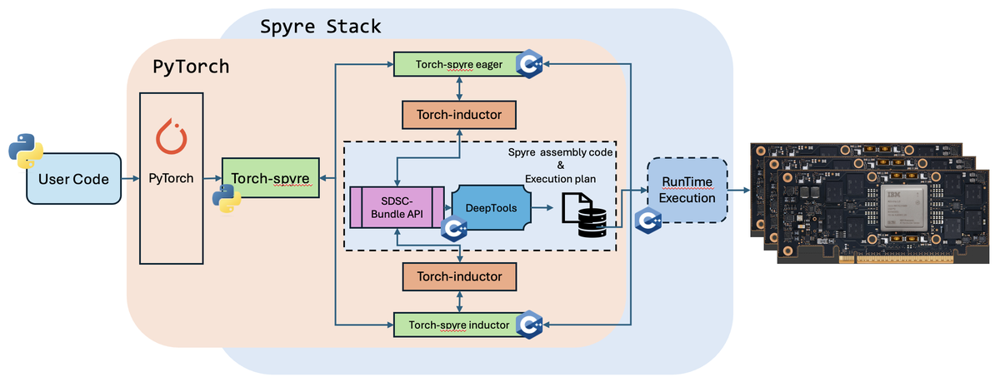
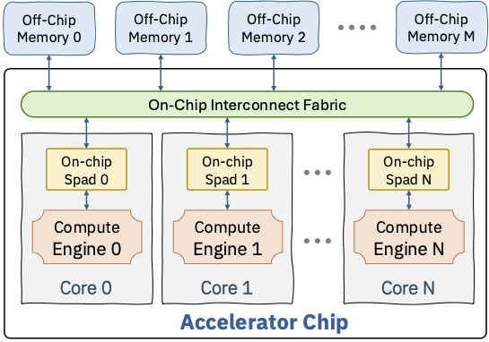

# **SuperDSC-Bundle Interface Specification**

**Spec Version:** 1.0.0
**Status:** Active

> The spec version follows the deeptoolsRelease versioning.

**Authors:**
* @lupalby
* @Prasanth-Chatarasi
* @bmahjour
* @viji560
* @vswagath1989
* @jneves60

## **Summary**

This document describes the `SuperDSC-Bundle`, the interface between the torch-spyre frontend compiler and the Spyre backend compiler (Deeptools).

For the complete API reference see the [Spec Map](#spec-map) at the end of this document.

## **Motivation**
The interface is essential to connect the torch-spyre frontend compiler with the Deeptools backend compiler to successfully map any operation to Spyre.

## **Proposed Implementation**

The figure below illustrates what is called the Spyre Stack, where a user-written PyTorch program is compiled by torch-spyre to generate a set of files known as the **SuperDSC-Bundle**. A PyTorch file may translate into several SuperDSC-Bundles, each one composed of a `bundle.mlir` file and several `sdsc_*.json` files. Each SuperDSC-Bundle is compiled by Deeptools to generate the assembly code and execution plan that runs on the Spyre AI Accelerator Card.

<p align="center">
  
</p>
<p align="center">
  Figure 1. High-level view of SuperDSC-Bundle API within the torch-spyre stack
</p>

`SuperDSC-Bundle` views the Spyre hardware at the data-parallel level of hardware abstraction. In this abstraction, Spyre is viewed as having multiple cores, with each core having a compute engine and a scratchpad memory. The cores are interfaced with each other and off-chip memory banks using an on-chip interconnect fabric.

<p align="center">
  
</p>
<p align="center">
  Figure 2. Hardware abstraction of multi-core accelerator embodied in `SuperDSC-Bundle`
</p>

`SuperDSC-Bundle` enables the frontend compilers to express data-parallel mappings of:
* Complex kernels comprised of a sequence of operations
* The work division (or computation split) across RaPiD cores of Spyre for each operation
* The placement of input/output tensors to each operation either in DDR memory or LX scratchpad of the RaPiD cores
* Shapes of the operations and tensors is allowed to be static or symbolic
* The start address of the tensors in DDR and LX is allowed to be a fixed number or symbolic

The `SuperDSC-Bundle` specification is used by the Deeptools backend compiler to produce `SpyreCode` containing the job binary, a job plan and other compiled artifacts. In the scenario where either the start-address and/or shapes are symbolic, `SpyreCode` allows for the program binary to contain variables that need to be substituted or corrected before execution. The mechanism to effect program correction just-in-time before the job is launched onto Spyre is also produced by the backend compiler as part of `SpyreCode`.

NOTES:
* Frontend/Backend compiler interface will transition to a new interface called Kernel Tile Intermediate Representation (KTIR) in the future (https://github.com/torch-spyre/rfcs/blob/main/0682-KtirSpec/0682-KtirSpecRFC.md)
* `SuperDSC` (without bundle capability) is the current interface between Deeptools frontend compiler and Deeptools backend compiler
* `SpyreCode` is tracked through: https://github.com/torch-spyre/torch-spyre/issues/277

## Structure of SuperDSC-Bundle

The backend expects the frontend to produce multiple output files that work in conjunction to instruct the backend on how one or multiple programs can be compiled and executed in a sequence as part of a complex kernel. The expectation is to receive:
* one or more `sdsc_*.json` files, each describing a Spyre operation
* one `bundle.mlir` file with the SuperDSC-Bundle IR

### API Components

The API consists of two primary components:

1. **MLIR Bundle File** (`.mlir`) — Orchestrates execution flow, symbol management, and operation sequencing across one or more SDSC JSON files. See [MLIR Bundle API](spec/dialect/MLIR-bundle-API.md) for the full dialect reference.
2. **SDSC JSON Files** (`.json`) — Each file defines a single operation and its core mapping. See [SDSC JSON API](spec/json/SDSC-json-api.md) for the step-by-step filling guide.

All `sdsc_*.json` files must conform to the [SDSC Bundle JSON Schema](spec/sdscbundle-schema.json). The schema is the normative reference for structural correctness — it enforces required fields, enum values, and type constraints at every level of the object hierarchy. Semantic constraints (cross-field consistency) are described in the individual object pages linked from [SDSC JSON API](spec/json/SDSC-json-api.md).

### SuperDSC JSON Structure

SuperDSC is a self-contained compiled artifact that describes everything the Spyre hardware needs to execute a single scheduled operation deterministically. The top-level structure contains core fold properties, work-slice mappings, and a per-core execution schedule. A `dscs_` array holds one or more `DesignSpaceConfig` entries, each being a complete description of one compute configuration. See the [JSON Object Hierarchy](spec/json/JSON-object-Hierarchy.md) for the full object tree.

Each `DesignSpaceConfig` entry contains the following elements:

- **Core fold properties** (`coreFoldProp_`, `numWkSlicesPerDim_`, `coreIdToWkSlice_`): how to divide the iteration space across 32 cores. For a tensor of shape (1024, 256), this encodes how many rows each core processes. The encoding gives each core an equal number of sticks and keeps each core within its addressable device memory limit.
- **Tensor descriptors** (`labeledDs_`, `primaryDsInfo_`): for each tensor argument, the tiling structure defines which dimensions are stick dimensions, how the host-side shape maps to device-side tiles, memory residency (HBM vs. LX scratchpad), data format, and which dimensions each tensor iterates over fully vs. which are summed over (contracted) as in the K dimension of a matmul.
- **Schedule tree** (`scheduleTree_`): a list of allocate nodes (one per tensor) that specify memory placement (HBM or LX scratchpad), dimension ordering, per-core start addresses via fold mappings, and coordinate information encoding how each dimension is split across cores with affine transformations.
- **Data staging** (`dataStageParam_`): per-core dimension sizes for steady-state and epilogue passes, describing how data is partitioned for transfer into scratchpad.
- **Compute operations** (`computeOp_`): one entry per operation, encoding the execution unit (PT or SFP), operation name, data format, fidelity, and the input/output tensor references from `labeledDs_`.

**Folding** is a central concept in SuperDSC. A single parameterized artifact can represent multiple execution variants across time steps and cores without recompilation. Fold properties use affine transformations (`alpha * index + beta`) to compute per-core coordinates and addresses, so one JSON file describes the behavior of all 32 cores compactly instead of duplicating the description for each core. See [FoldProperty](spec/json/foldproperty.md) and [FoldManager](spec/json/foldmanager.md) for details.

### Important Notes

**DesignSpaceConfig can represent BOTH deep learning operators AND data-shuffle operations:**

- **Deep learning operators**: Matmul, convolution, activations, reductions, etc.
- **Data-shuffle operations**: Stick-breaking, non-stick breaking, gather, scatter

**Tensor allocation need NOT be compatible with compute work division.** Data in one core can be directly available for compute in another core — the backend compiler will ensure proper data movement across cores. This functionality is fully supported by the backend.

### SuperDSC-Bundle MLIR Representation

The `bundle.mlir` file conveys a complex kernel made of one or multiple operations. It chains together multiple SDSC operations in sequence and can add loops around them using new and existing MLIR operations. For the complete dialect reference with all syntax tables and examples see [MLIR Bundle API](spec/dialect/MLIR-bundle-API.md).

#### Bundle Container

A SuperDSC Bundle is expressed as a standard MLIR `module` containing a single `func.func`. The function declares the bundle entry point: it has no return values and its body ends with `return`. It may declare zero or more parameters — each is either a compile-time `index` value or a runtime-provided `!sdscbundle.input_arg<index>` value (which must be extracted with `sdscbundle.input_arg_extract` before use).

```mlir
module {
  func.func @sdsc_bundle(%param_0: index,
                         %param_1: !sdscbundle.input_arg<index>) {
    // Bundle operations
    return
  }
}
```

Each parameter is one of:

| Type | Description |
|---|---|
| *(none)* | No parameters — all symbol values are embedded as `arith.constant` values inside the function body. |
| `index` | A resolved symbol value passed directly as a constant index. |
| `!sdscbundle.input_arg<index>` | A runtime-provided symbol value. May carry optional `granularity=N` and/or `max_value=N` annotations. Must be extracted with `sdscbundle.input_arg_extract` before use. |

#### Symbolic Values and Addresses

Within a SuperDSC Bundle there are two distinct ways a value can be symbolic — not fixed at compile time and resolved by the backend just before the job is launched.

**Symbolic Addresses** — a tensor's start address in device memory is not a concrete byte offset at compile time. On the JSON side: set `isStartAddrSymbolic_: true` on the `allocate` node in `scheduleTree_` and place symbolic identifier strings in `startAddressCoreCorelet_.data_`. On the MLIR side: supply the runtime value as an operand to `sdscbundle.sdsc_execute` via `symbol_ids`.

**Symbolic Dimension Sizes** — a tensor shape dimension (e.g. sequence length or batch size) varies at runtime. On the JSON side: `DesignSpaceConfig.dimToSymbolMapping_` maps dimension names to symbolic variable names; `DataStructDims.symbolicDimInfo_` records `maxSize_` and `granularity_` for each symbolic dimension; `SuperDsc.symbolDefinitions_`, `inputSymbolsAndTags_`, and `dimToSymbolMappingOpcodeCorrection_` hold the top-level symbol registry. On the MLIR side: the runtime value is also supplied as an operand to `sdscbundle.sdsc_execute` via `symbol_ids` — the same mechanism as symbolic addresses.

From the MLIR perspective both kinds of symbolic value are unified: they are operands to `sdscbundle.sdsc_execute` bound via `symbol_ids`. The distinction is on the JSON side — the backend routes each symbol ID to the appropriate field depending on whether it is bound to an `isStartAddrSymbolic_` allocate node (address) or to a `dimToSymbolMapping_` entry (size). When a symbolic dimension is split across cores, both kinds appear together in the same JSON file.

#### `sdscbundle` Dialect Operations and Supporting MLIR Operations

For the complete reference — `sdscbundle.sdsc_execute`, `sdscbundle.device_mem_allocate`, `sdscbundle.input_arg_extract`, `scf.for`, `arith.constant`, `arith.addi`, and `affine.apply` — with full syntax tables, constraints, and examples, see [MLIR Bundle API](spec/dialect/MLIR-bundle-API.md).

### `sdsc_*.json` Filling

Each `sdsc_*.json` file describes a single torch operation. For the complete step-by-step filling guide (Steps 1–9) with all field constraints and instructions, see [SDSC JSON API](spec/json/SDSC-json-api.md).

### SuperDsc Object Fields

The `SuperDsc` object is the top-level object of every `sdsc_*.json` file. For the full field reference see [SuperDsc Object](spec/json/superdsc-object.md).

### Supported OpFuncs in `sdsc.json`

For the full list of supported `opFuncName` values, see [ComputeOperation — Supported Operations](spec/json/computeoperation.md#supported-operations).

### Stick Constraints for the Operations

Each operation category imposes constraints on stick composition, restricting which dimensions can be present in the stick. Tensors must be padded to meet these constraints. There are no constraints on tensor layout beyond the stick.

**Important:** Stick constraints can cause a ripple effect — a tensor may need padding even in its non-stick dimension if that dimension appears in the stick of another tensor feeding the same operation. This ensures dimension span consistency across all tensors.

For per-category stick layouts and padding rules see [Stick Layout Constraints](spec/json/stick-layout-constraints.md).

### Core Work Division Constraints

For per-core work extent rules (stick-multiple alignment, DDR address span, index tensors, and multi-dimension reduction splits) see [Stick Layout Constraints — Core Work Division](spec/json/stick-layout-constraints.md#core-work-division-constraints).

## Examples

The table below lists all available examples in recommended reading order.

### MLIR Bundle Examples

| # | Description | File |
|---|---|---|
| 1 | Single operation (no symbols) | [MLIR-examples.md — Single Operation](spec/json/MLIR-examples.md#single-operation-no-symbols) |
| 2 | Sequential operations — kernel fusion (softmax) | [MLIR-examples.md — Sequential Operations](spec/json/MLIR-examples.md#sequential-operations-kernel-fusion) |
| 3 | Symbolic address — runtime-provided base address | [MLIR-examples.md — Symbolic Address](spec/json/MLIR-examples.md#symbolic-address--runtime-provided-base-address) |
| 4 | Symbolic address — per-core addresses from a runtime base | [MLIR-examples.md — Per-Core Addresses](spec/json/MLIR-examples.md#symbolic-address--per-core-addresses-from-a-runtime-base) |
| 5 | Symbolic dimension size — single symbolic batch dimension | [MLIR-examples.md — Symbolic Dimension](spec/json/MLIR-examples.md#symbolic-dimension-size--single-symbolic-batch-dimension) |
| 6 | Symbolic dimension size — split across cores | [MLIR-examples.md — Symbolic Dimension Split](spec/json/MLIR-examples.md#symbolic-dimension-size--symbolic-dimension-split-across-cores) |
| 7 | Loop with dynamic addresses (`scf.for` + `affine.apply`) | [MLIR-examples.md — Loop](spec/json/MLIR-examples.md#loop-with-dynamic-addresses) |
| 8 | Multi-core with per-core addresses | [MLIR-examples.md — Multi-Core](spec/json/MLIR-examples.md#multi-core-with-per-core-addresses) |
| 9 | Device memory allocation — intermediate buffer | [MLIR-examples.md — Intermediate Buffer](spec/json/MLIR-examples.md#simple-intermediate-buffer) |
| 10 | Device memory allocation — pool sub-allocation | [MLIR-examples.md — Pool Sub-Allocation](spec/json/MLIR-examples.md#pool-sub-allocation) |
| 11 | Complete MLIR example — softmax with dynamic shapes | [MLIR-complete-example.md](spec/json/MLIR-complete-example.md) |

### JSON Examples

| # | Description | File |
|---|---|---|
| 12 | Complete JSON example — simple GELU operation | [JSON-examples.md — Complete Example](spec/json/JSON-examples.md#complete-example--simple-gelu-operation) |
| 13 | Indirect access — Top-K gather operation | [JSON-examples.md — Indirect Access](spec/json/JSON-examples.md#indirect-access-example--top-k-gather-operation) |

## **Metrics**

* Ability to express all torch operators that are mappable to AIU (post-inductor transformations and decompositions)
* Ability to express desired computation mapping across cores for each operation

---

## Spec Map

Quick reference to every document in this specification, grouped by role.

### Guide

| Document | Description |
|----------|-------------|
| [Overview](guide/Overview.md) | Spyre stack overview and the two API components |

### MLIR Dialect — `sdscbundle`

| Document | Description |
|----------|-------------|
| [MLIR Bundle API](spec/dialect/MLIR-bundle-API.md) | Dialect operations, bundle container, symbolic values |
| [MLIR Examples](spec/json/MLIR-examples.md) | Annotated MLIR bundle examples |
| [MLIR Complete Example](spec/json/MLIR-complete-example.md) | Full end-to-end MLIR bundle |

### JSON Layer

| Document | Description |
|----------|-------------|
| [SDSC JSON API](spec/json/SDSC-json-api.md) | File structure and field-filling walkthrough |
| [Object Hierarchy](spec/json/JSON-object-Hierarchy.md) | Annotated tree of every JSON key |
| [JSON Schema (normative)](spec/sdscbundle-schema.json) | Machine-readable JSON Schema |

### JSON Object Reference

| Object | File |
|--------|------|
| SuperDsc | [superdsc-object.md](spec/json/superdsc-object.md) |
| FoldProperty | [foldproperty.md](spec/json/foldproperty.md) |
| FoldManager | [foldmanager.md](spec/json/foldmanager.md) |
| Padding | [padding.md](spec/json/padding.md) |
| Stick-Alignment Padding | [stick-padding.md](spec/json/stick-padding.md) |
| Stick Layout Constraints | [stick-layout-constraints.md](spec/json/stick-layout-constraints.md) |
| DesignSpaceConfig | [designspaceconfig.md](spec/json/designspaceconfig.md) |
| LabeledDataStructure | [labeleddatastructure.md](spec/json/labeleddatastructure.md) |
| MemoryOrganization | [memoryorganization.md](spec/json/memoryorganization.md) |
| PrimaryDsInfo | [primarydsinfo.md](spec/json/primarydsinfo.md) |
| DataStructDims | [datastructdims.md](spec/json/datastructdims.md) |
| DataStageParam | [datastageparam.md](spec/json/datastageparam.md) |
| ScheduleTreeNode | [scheduletreenode.md](spec/json/scheduletreenode.md) |
| CoordinateContainer | [coordinatecontainer.md](spec/json/coordinatecontainer.md) |
| CoordinateInfo | [coordinateinfo.md](spec/json/coordinateinfo.md) |
| ComputeOperation | [computeoperation.md](spec/json/computeoperation.md) |
| ConstantInfo | [constantinfo.md](spec/json/constantinfo.md) |

### Worked Examples

| Document | Description |
|----------|-------------|
| [JSON Examples](spec/json/JSON-examples.md) | Complete and indirect-access JSON examples |

### References

| Document | Description |
|----------|-------------|
| [References](spec/reference.md) | External specs and normative references |

