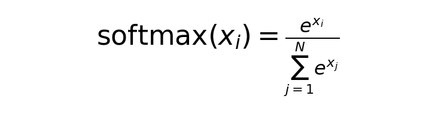

# MLIR Bundle API

## Module Structure

**Definition:**

A `module` represents a top-level container operation. It describes a single
graph region containing one block where one or more operations are described.
Modules are isolated, meaning operations described within cannot capture values
defined outside the module.
The `func.func` operation defines a standalone callable function. It declares the
function name, arguments, visibility and attributes. In the context of SDSC
Bundles there are no return values.

**Syntax:**

```mlir
module {
  func.func @function_name() {
    // Bundle operations
    return
  }
}
```

**Parameters:**

- **@function_name**: Identifier for the callable function region

**Returns:** None — `func.func` in SDSC Bundles always has no return values; the body ends with `return`.

**Example:**

```mlir
module {
  func.func @gelu_forward() {
    sdscbundle.sdsc_execute () {sdsc_filename="sdscGelu.json"}
    return
  }
}
```

---

## Core Operations

### sdscbundle.sdsc_execute

**Description:**

Instantiates and executes a SuperDSC operation. Each `sdsc_execute` call references one SDSC JSON file. A single `func.func` body may contain one or more `sdsc_execute` calls in sequence, with each call referencing a different JSON file. This is how kernel fusion is expressed — multiple operations (e.g., the five steps of a softmax) are chained as sequential invocations within the same function. Each invocation optionally substitutes symbolic addresses or sizes with the SSA values provided as operands.

**Syntax:**

```mlir
sdscbundle.sdsc_execute (%operand1, %operand2, ...) {
  sdsc_filename = "path/to/sdsc.json",
  symbol_ids = [id1, id2, ...]
}
```

**Parameters:**

- **Operands** (optional): SSA values for symbolic parameters
  - Type: `index`
  - Order must match `symbol_ids` order
  - Can be constants, affine expressions, or loop iterators
  - Each `sdsc_execute` call has its own independent operand list

**Attributes:**

- **sdsc_filename** (required): `string`
  - Relative path to the SDSC JSON file for this invocation; one file per call
  - Path is relative to MLIR file location

- **symbol_ids** (optional): `array<int>`
  - List of symbol IDs used in the SDSC
  - Negative integers (e.g., `-1`, `-2`, `-3`)
  - Maps to symbolic start addresses or sizes in SDSC; each ID corresponds positionally to one operand
  - Symbol IDs are scoped per invocation — the same ID (e.g., `-1`) in two different calls is independent

**Returns:** None

**Examples:**

Minimal — single operation, no symbols:

```mlir
sdscbundle.sdsc_execute () {sdsc_filename="sdsc.json"}
```

With a symbolic address:

```mlir
%addr = arith.constant 1024 : index
sdscbundle.sdsc_execute (%addr) {
  sdsc_filename="sdsc.json",
  symbol_ids=[-1]
}
```

With multiple symbolic addresses (one per core):

```mlir
%addr_c0 = arith.constant 1024 : index
%addr_c1 = arith.constant 1152 : index
sdscbundle.sdsc_execute (%addr_c0, %addr_c1) {
  sdsc_filename="sdsc.json",
  symbol_ids=[-1, -2]
}
```

Sequential operations — multiple JSON files in one function (softmax kernel fusion):



*The softmax function: for each element x_i, divide its exponent by the sum of exponents of all elements.*


```mlir
module {
  func.func @sdsc_bundle() {
    sdscbundle.sdsc_execute () {sdsc_filename="sdsc_0_maxnonstick.json"}
    sdscbundle.sdsc_execute () {sdsc_filename="sdsc_1_sub.json"}
    sdscbundle.sdsc_execute () {sdsc_filename="sdsc_2_exp.json"}
    sdscbundle.sdsc_execute () {sdsc_filename="sdsc_3_sumnonstick.json"}
    sdscbundle.sdsc_execute () {sdsc_filename="sdsc_4_realdiv.json"}
    return
  }
}
```

---

## Control Flow

### scf.for

**Description:**

Loop construct from the Structured Control Flow (SCF) dialect. Used to iteratively execute one or more SDSC operations, typically to process batches or to apply address offsets per iteration. Loop bounds must be compile-time constants; no loop-carried variables are supported.

**Syntax:**

```mlir
scf.for %iterator = %lower_bound to %upper_bound step %step {
  // Loop body with SDSC executions
}
```

**Parameters:**

- **%iterator**: Loop induction variable (type: `index`) — available inside the loop body
- **%lower_bound**: Starting value, inclusive (type: `index`)
- **%upper_bound**: Ending value, exclusive (type: `index`)
- **%step**: Increment per iteration (type: `index`)

**Attributes:** None — bounds and step are SSA values, not attributes.

**Returns:** None — `scf.for` in SDSC Bundles carries no results.

**Constraints:**

- Loop bounds must be constants
- No loop-carried variables supported
- Only the induction variable can be used directly inside the loop body

**Example:**

```mlir
%c0 = arith.constant 0 : index
%c1 = arith.constant 1 : index
%c8 = arith.constant 8 : index

scf.for %i = %c0 to %c8 step %c1 {
  %addr = affine.apply affine_map<(d0) -> (1024 + 128*d0)> (%i)
  sdscbundle.sdsc_execute (%addr) {
    sdsc_filename="sdsc.json",
    symbol_ids=[-1]
  }
}
```

---

## Arithmetic Operations

### arith.constant

**Description:**

Defines a compile-time constant SSA value. In the SDSC Bundle context this is primarily used to define base addresses, loop bounds, and loop step values that are passed as operands to `sdscbundle.sdsc_execute` or `scf.for`.

**Syntax:**

```mlir
%name = arith.constant <value> : <type>
```

**Parameters:**

- **%name**: SSA result name bound to the constant
- **\<value\>**: Integer or index literal
- **\<type\>**: Value type; always `index` in SDSC Bundle usage

**Attributes:**

- **value** (required): The compile-time constant to be materialised; encoded as an integer literal in the source text.

**Returns:** A single SSA value of the declared type.

**Example:**

```mlir
%base_addr   = arith.constant 1024  : index
%lower_bound = arith.constant 0     : index
%upper_bound = arith.constant 8     : index
%step        = arith.constant 1     : index
```

### arith.addi

**Description:**

Performs integer addition of two SSA values. In the SDSC Bundle context this is used to compute memory addresses by adding an offset to a base address — for example, combining a loop-invariant base with a per-iteration stride when `affine.apply` is not used.

**Syntax:**

```mlir
%result = arith.addi %lhs, %rhs : <type>
```

**Parameters:**

- **%lhs**: Left-hand operand (type: `index`)
- **%rhs**: Right-hand operand (type: `index`)

**Attributes:** None — both operands are SSA values.

**Returns:** A single SSA value of the same type as the operands, containing the integer sum.

**Examples:**

Add a fixed offset to a base address:

```mlir
%base   = arith.constant 1024 : index
%offset = arith.constant 256  : index
%addr   = arith.addi %base, %offset : index
```

Combine a base address with a loop-derived stride:

```mlir
%base   = arith.constant 1024 : index
%stride = arith.constant 128  : index
%i_stride = arith.muli %i, %stride : index
%addr     = arith.addi %base, %i_stride : index
sdscbundle.sdsc_execute (%addr) {
  sdsc_filename="sdsc.json",
  symbol_ids=[-1]
}
```

---

## Affine Operations

### affine.apply

**Description:**

Applies a compile-time affine map to a set of dimension and symbol operands, producing a single `index` result. Used in SDSC Bundles to compute per-iteration or per-core memory addresses from a base address and loop variables.

**Syntax:**

```mlir
%result = affine.apply affine_map<(dims)[symbols] -> (expression)> (dim_values)[symbol_values]
```

**Affine Map Definition:**

```mlir
#map_name = affine_map<(d0, d1, ...)[s0, s1, ...] -> (expression)>
```

**Parameters:**

- **dim_values**: SSA values bound to dimension variables `d0, d1, ...` (e.g., loop iterators, core IDs)
- **symbol_values**: SSA values bound to symbol variables `s0, s1, ...` (e.g., base addresses — must be loop-invariant)

**Attributes:**

- **affine_map** (required): A compile-time affine expression. Supports the following operators:
  - Addition: `+`
  - Multiplication: `*`
  - Floor division: `floordiv`
  - Ceiling division: `ceildiv`
  - Modulo: `mod`

**Returns:** A single SSA `index` value — the result of evaluating the affine expression with the supplied operands.

**Examples:**

Single-variable address stride:

```mlir
#stride_map = affine_map<(d0)[base] -> (base + 128*d0)>
%addr = affine.apply #stride_map (%i)[%base_address]
```

Two-variable map combining iteration index and core ID:

```mlir
#addr_map = affine_map<(d0, core)[base] -> (base + 1024*d0 + 256*core)>
%addr = affine.apply #addr_map (%i, %core_id)[%base_address]
```

Concrete evaluation of the above map:

Given:
- `%i = 3` (iteration index)
- `%core_id = 2` (core identifier)
- `%base_address = 0x10000` (65536 in decimal)

```
%addr = 65536 + 1024*3 + 256*2
     = 65536 + 3072 + 512
     = 69120 (0x10E00 in hex)
```

This calculates a memory address by:
1. Starting at base address (65536)
2. Adding iteration offset (1024 bytes per iteration × 3)
3. Adding core-specific offset (256 bytes per core × 2)

---

| [← Back to Table of Contents](README.md) | &nbsp;&nbsp;&nbsp;&nbsp;&nbsp;&nbsp;&nbsp;&nbsp;&nbsp;&nbsp;&nbsp;&nbsp;&nbsp;&nbsp;&nbsp;&nbsp;&nbsp;&nbsp;&nbsp;&nbsp; | [Next: Bundle Usage Examples →](1.3-mlir-bundle-usage-examples.md) |
|:--|:--:|--:|
