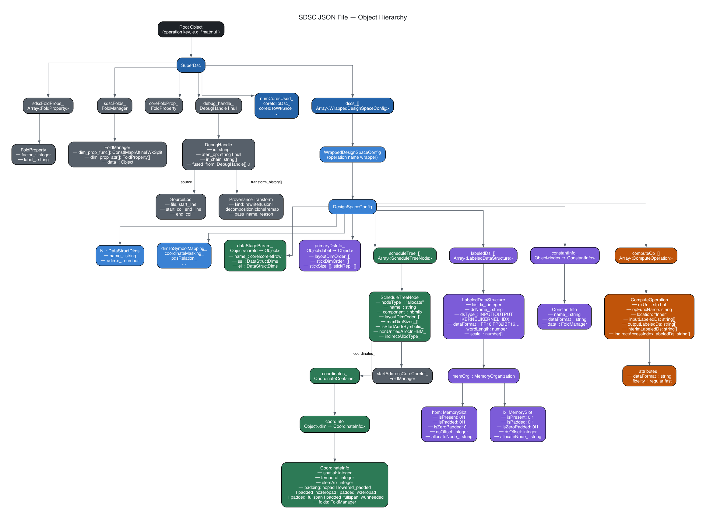

# SDSC JSON API

## Introduction

Each `sdsc_*.json` file in a SuperDSC-Bundle describes a single torch operation to be executed on the Spyre backend (DeepTools). One JSON file encodes everything the hardware needs to execute that operation deterministically across 1 or multiple cores: how the iteration space is divided, how tensors are laid out in memory, where data lives (HBM vs. LX scratchpad), and what compute to perform.

A PyTorch model may translate into several SuperDSC-Bundles. Each bundle is composed of a `bundle.mlir` file (which orchestrates execution flow and symbol management — see [MLIR Bundle API](MLIR-bundle-API.md)) and one or more `sdsc_*.json` files. Each JSON file corresponds to one torch operation.

The different sections of an SDSC JSON file describe the following:

- **Core fold properties** — how the iteration space is divided across cores
- **Tensor descriptors** — layout, memory residency, data format, and stick configuration for each tensor
- **Schedule tree** — per-tensor memory allocation, start addresses, and coordinate mappings
- **Data staging** — per-core tile sizes for steady-state and epilogue passes
- **Compute operations** — execution unit, operation name, and input/output tensor references

## Key Components

An SDSC JSON file is structured as a single top-level key (the operation name) whose value is a **SuperDsc** object. The SuperDsc object holds a few top-level fields and a `dscs_[]` array of **DesignSpaceConfig** entries. Each `dscs_[]` entry is itself a single-key object wrapping a `DesignSpaceConfig` — some of its fields are leaf values while others are composite objects that drill down further into the object hierarchy.

*Figure: Complete object hierarchy of an SDSC JSON file.*

**Colour legend**

| Colour | Group | Objects |
|---|---|---|
| Dark grey | Fold / coordinate reusables | `FoldProperty`, `FoldManager`, `DebugHandle`, `SourceLoc`, `ProvenanceTransform` |
| Blue | Bundle / DSC structure | `SuperDsc`, `WrappedDesignSpaceConfig`, `DesignSpaceConfig` |
| Violet | Tensor objects | `LabeledDataStructure`, `MemoryOrganization`, `PrimaryDsInfo`, `ConstantInfo` |
| Green | Scheduling & coordinate objects | `ScheduleTreeNode`, `CoordinateContainer`, `CoordinateInfo`, `DataStageParam` |
| Amber | Compute objects | `ComputeOperation`, `attributes_` |

| Component | Role | Reference |
|---|---|---|
| **Object Hierarchy** | Full object tree of the entire JSON format | [JSON-object-Hierarchy.md](JSON-object-Hierarchy.md) |
| **SuperDsc** | Root object — holds fold properties, work-slice maps, core schedule, and the `dscs_[]` array | [superdsc-object.md](superdsc-object.md) |
| **DesignSpaceConfig** | Per-operation configuration — tensors, staging, schedule, and compute | [designspaceconfig.md](designspaceconfig.md) |
| **LabeledDataStructure** | Tensor descriptor — role, format, scale, and memory residency | [labeleddatastructure.md](labeleddatastructure.md) |
| **PrimaryDsInfo** | Tensor-type layout — memory dimension order and stick configuration | [primarydsinfo.md](primarydsinfo.md) |
| **DataStageParam** | Per-core tile sizes for steady-state and epilogue passes | [datastageparam.md](datastageparam.md) |
| **ScheduleTreeNode** | Memory allocation node — component, start addresses, coordinates | [scheduletreenode.md](scheduletreenode.md) |
| **ComputeOperation** | Compute specification — execution unit, op name, tensor references | [computeoperation.md](computeoperation.md) |
| **MemoryOrganization** | HBM / LX scratchpad residency flags per tensor | [memoryorganization.md](memoryorganization.md) |

---

## Filling a JSON File — Step-by-Step

This section walks through filling an SDSC JSON file in the same order as the
[`SuperDsc` object hierarchy](JSON-object-Hierarchy.md): top-level container
first, then the per-operation `DesignSpaceConfig` fields in the order they
appear in the schema, finishing with the deepest leaf objects.

| Step | Object / Field | Hierarchy level |
|---|---|---|
| 1 | Root key · `SuperDsc`: `coreFoldProp_`, `coreletFoldProp_`, `numCoresUsed_` | Root → SuperDsc |
| 2 | `SuperDsc`: `numWkSlicesPerDim_`, `coreIdToWkSlice_`, `coreIdToDsc_`, `coreIdToDscSchedule` | SuperDsc |
| 3 | `dscs_` entry · `DesignSpaceConfig`: `numCoresUsed_`, `coreIdsUsed_` | SuperDsc → DSC |
| 4 | `DesignSpaceConfig`: `N_`, `dataStageParam_` | DSC |
| 5 | `DesignSpaceConfig`: `primaryDsInfo_` | DSC |
| 6 | `DesignSpaceConfig`: `scheduleTree_` → `ScheduleTreeNode` → `coordinates_` → `CoordinateInfo` | DSC (deepest branch) |
| 7 | `DesignSpaceConfig`: `labeledDs_` → `LabeledDataStructure` → `memOrg_` | DSC |
| 8 | `DesignSpaceConfig`: `constantInfo_` → `ConstantInfo` | DSC |
| 9 | `DesignSpaceConfig`: `computeOp_` → `ComputeOperation` | DSC (last leaf) |

### Step 1 — Root key and SuperDsc fold properties

Create the root object with a single key — the operation name string
(pattern `^[a-zA-Z0-9_/\-][a-zA-Z0-9_/\-]*$`). Its value is the
[`SuperDsc`](superdsc-object.md) object. Fill the fold properties first, as
every [`FoldManager`](foldmanager.md) used later inherits from these:

- Set `coreFoldProp_.factor_` to the maximum core ID in use (e.g. `32` for a
  full-chip bundle). Set `label_` to `"core"`.
- Set `coreletFoldProp_.factor_` to `2`. Set `label_` to `"corelet"`.
- Set `numCoresUsed_` to the total number of cores.
- (Optional) Set `sdscFoldProps_` and `sdscFolds_` only when bundle-level fold
  dimensions above the core level are required.

### Step 2 — SuperDsc work-division maps

Still in [`SuperDsc`](superdsc-object.md), fill the maps that assign work
slices and DSC indices to cores:

- Set `numWkSlicesPerDim_`: for each dimension being split across cores, record
  the total number of slices (e.g. `{"mb": 2}` for a 2-way minibatch split).
- Set `coreIdToWkSlice_`: for each core ID, map each split dimension to the
  slice index that core handles (e.g. `{"0": {"mb": 0}, "1": {"mb": 1}}`).
- Set `coreIdToDsc_`: map each core ID (as a string integer) to its zero-based
  index into `dscs_`. All cores typically map to `0` when work is balanced.
- Set `coreIdToDscSchedule`: for each core, one schedule tuple `[0, 0, 0, 0]`
  covers the common case (single DSC, no barriers). The four integers are
  `[datadsc_idx, dldsc_idx, before_sync, after_sync]`.
- (Optional) Populate `inputSymbolsAndTags_`, `symbolDefinitions_`, and
  `dimToSymbolMappingOpcodeCorrection_` when symbolic dimensions are used.

### Step 3 — DesignSpaceConfig identity (inside dscs_)

Add one entry to `dscs_` — a single-key object `{"<op_name>": <DesignSpaceConfig>}`.
Inside the [`DesignSpaceConfig`](designspaceconfig.md), set the core identity
fields first, as they are referenced by the data-staging and tensor steps below:

- Set `numCoresUsed_` and `coreIdsUsed_` to match the cores assigned to this
  DSC via `coreIdToDsc_` in Step 2.

### Step 4 — Total operation dimensions (N_) and data staging (dataStageParam_)

In [`DesignSpaceConfig.N_`](datastructdims.md):

- Set each dimension field that participates in the operation to its total
  (un-tiled) size. Set all others to `-1`.
- For symbolic dimensions, set the field to `-1` (sentinel) and populate
  `dimToSymbolMapping_` to link each symbolic dimension name to its symbol ID.

In [`DesignSpaceConfig.dataStageParam_`](datastageparam.md):

- Add exactly one entry with key `"0"`. Set `name_` to `"core"`.
- Set `ss_` and `el_` to the per-core tile sizes. When work divides evenly
  `ss_` and `el_` are identical; `el_` carries the smaller final tile
  when it does not.
- For window/padded operations (avgpool, depthwise conv2d): add `paddingSizes_`
  to both `ss_` and `el_`. If a padded dimension is split across cores, set
  `padFront_` and `padBack_` to `-1` in the per-core datastage entry.
  See [Padding](padding.md) for the full field set.
- For symbolic dimensions: add `symbolicDimInfo_` inside each
  [`DataStructDims`](datastructdims.md). Set `maxSize_` to the upper bound and
  `granularity_` to the step constraint. When the dimension is split across N
  cores, `granularity_` must be a multiple of N, and `ss_`/`el_` values must
  be scaled to the per-core size.

### Step 5 — Tensor layout (primaryDsInfo_)

In [`DesignSpaceConfig.primaryDsInfo_`](primarydsinfo.md), add one entry for
each distinct tensor role. Multiple tensors that share the same stick layout
can share one entry:

- Key each entry by `dsType_` (`"INPUT"`, `"OUTPUT"`, `"KERNEL"`,
  `"KERNEL_IDX"`).
- Set `layoutDimOrder_` (outermost dimension first).
- Set `stickDimOrder_` and `stickSize_` as parallel arrays. Consult
  [Stick Layout Constraints](stick-layout-constraints.md) for the exact
  stick rules for each operation category.

### Step 6 — Memory allocation schedule (scheduleTree_)

In [`DesignSpaceConfig.scheduleTree_`](scheduletreenode.md), add one
[`ScheduleTreeNode`](scheduletreenode.md) per tensor, in the order tensors
will be allocated:

- Set `nodeType_: "allocate"`, a unique `name_`, and `ldsIdx_` matching the
  tensor's sequential position in `labeledDs_` (filled in Step 7).
- Set `component_` to `"hbm"` or `"lx"`.
- Set `layoutDimOrder_` and `maxDimSizes_` (use `-1` for unbound dimensions;
  use the page size for paged value tensors).
- Set `startAddressCoreCorelet_` as a [`FoldManager`](foldmanager.md):
  - First fold dimension: `Map` function — each core ID maps to its own start
    address in `data_`.
  - Second fold dimension: `Const` function — all corelets on a core share the
    same base address.
  - When the address is not known at compile time, set
    `isStartAddrSymbolic_: true` and use the symbol ID string (e.g. `"-1"`) as
    the `data_` value in place of a concrete byte offset.
- For back-gaps: populate `backGapCore_` with the gap size in elements, keyed
  by dimension then by core ID. Use `"-1"` as the core ID key for HBM
  allocations; use the actual core ID for LX allocations. Only back-gaps are
  encoded here — front gaps are handled by advancing the start address.
- For indirect access (paged tensors): set `indirectAllocType_` to
  `"value_tensor"` or `"index_tensor"`, set `relatedIndirectAccessAlloc_` to
  the name of the counterpart node, and set `indexTensorType_` (`"index"` or
  `"address"`) on the index tensor's node.
- Set `coordinates_` (a [`CoordinateContainer`](coordinatecontainer.md)): for
  each tensor dimension, add a [`CoordinateInfo`](coordinateinfo.md) entry
  whose `folds` [`FoldManager`](foldmanager.md) encodes the affine split
  hierarchy (core → corelet → row → elements). The product of all `factor_`
  values across all fold levels must equal the total element count for that
  dimension.

### Step 7 — Tensor descriptors (labeledDs_)

In [`DesignSpaceConfig.labeledDs_`](labeleddatastructure.md), add one
[`LabeledDataStructure`](labeleddatastructure.md) per tensor in the same
order used for `ldsIdx_` in Step 6:

- Assign sequential `ldsIdx_` values (0, 1, 2, …) and a unique `dsName_`.
- Set `dsType_` to match the key used in `primaryDsInfo_` (Step 5).
- Set `dataFormat_` and optionally `wordLength`.
- Set `scale_`: one entry per layout dimension in `layoutDimOrder_` order.
  `1` = normal size, `-1` = reduced/broadcast, `-2` = reduced/broadcast stick
  dimension.
- Set `memOrg_`: set `hbm.isPresent` and/or `lx.isPresent` to `1` to match
  the `component_` set on the corresponding `scheduleTree_` node (Step 6).

### Step 8 — Constants (constantInfo_)

In [`DesignSpaceConfig.constantInfo_`](constantinfo.md):

- If the operation requires no constants, set the field to the string `"{}"`.
- Otherwise, add one entry per constant, keyed by sequential string integer
  (`"0"`, `"1"`, …). For each:
  - Set `name_` to the agreed constant name for that operation.
  - Set `dataFormat_` to match the tensors it is applied to.
  - Set `data_` as a [`FoldManager`](foldmanager.md): use `Const` at both the
    core and corelet fold levels when the value is the same on all cores (the
    common case). Use `Map` at the core level only when the value differs per
    core. Encode the value in the specified `dataFormat_` without zero-padding
    to 32 bits; only one element entry in the vector is needed.

### Step 9 — Compute operation (computeOp_)

In [`DesignSpaceConfig.computeOp_`](computeoperation.md):

- Set `opFuncName` to the operation string (e.g. `"gelufwd"`, `"batchmatmul"`).
  See the full table in [`SuperDSC-Bundle.md`](https://github.com/torch-spyre/interface-specs/blob/main/0248-SdscBundleSpec/SuperDSC-Bundle.md#supported-opfuncs-in-sdscjson).
- Set `attributes_.dataFormat_` to the execution format (`"SEN169_FP16"`,
  `"IEEE_FP32"`, …).
- Set `exUnit` to `"sfp"` or `"pt"`.
- Populate `inputLabeledDs` and `outputLabeledDs` using the
  `"<dsName_>-idx<ldsIdx_>"` composite names established in Step 7
  (e.g. `"gelu-Tensor0-idx0"`).
- For indirect access operations: populate `indirectAccessIndexLabeledDs` with
  the index tensor references.

---

| [← Previous: MLIR Complete Example](MLIR-complete-example.md) | [↑ Table of Contents](README.md) | [Next: Object Hierarchy →](JSON-object-Hierarchy.md) |
|:--|:--:|--:|
